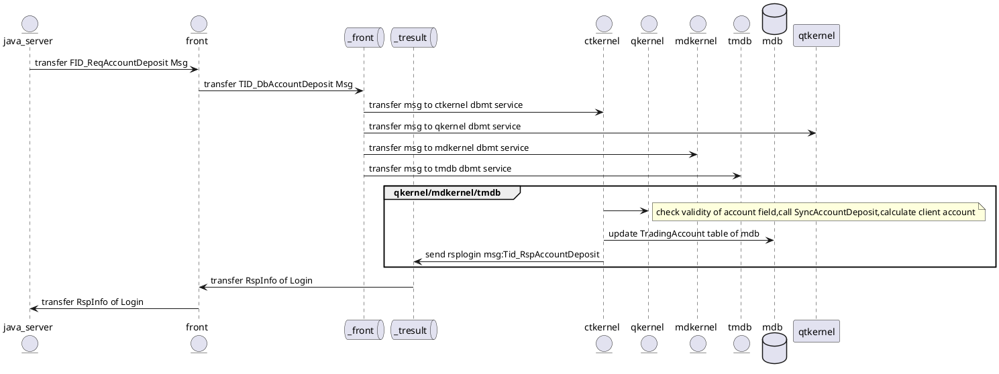

<!-- TOC -->

[1. lamda](#1-lamda)
[2. smart pointer](#2-smart_pointer)
[3. new enum](#3-new_enum)
[4. cast & type](#4-cast_type)
[5. lvalue & rvalue](#5-lvalue_rvalue)
[6. move & forward](#6-move_forward)
[7. variadic template](#7-variadic_template)
[8. tuple](#8-tuple)
[9. functional & bind](#9-functional_bind)
[10. emplace](#10-emplace)

<!-- TOC -->

# 1. lamda
    + [captures](params) -> ret {statements;}

        - [] 不能访问外部变量

        - [&] 引用方式访问外部变量，[&var]引用访问var变量，[&]引用访问所有变量

        - [=]按值访问外部变量，[var]按值访问var，[=]按值访问所有变量

        - [=,&var] 能够按照引用访问var和按值访问所有变量

        - 特殊情况：lambda函数在某个成员函数里面时，[this]和[=]可以访问这个成员函数所能访问的对象   


```cpp
//g++ tes.cc -std=c++11  -o  te 
#include <functional>
#include <iostream>
 
int main()
{
   using namespace std;
 
   int i = 3;
   int j = 5;
 
   // The following lambda expression captures i by value and
   // j by reference.
   function<int (void)> f = [i, &j] { return i + j; };//声明定义f的时候，使用i的值传入，j的引用
 
   // Change the values of i and j.
   i = 22;
   j = 44;
 
   // Call f and print its result.
   cout << f() << endl; //output:3+44=47
}
------------------------
//use lamda directly
#include <iostream>
 
int main()
{
   using namespace std;
   int n = [] (int x, int y) { return x + y; }(5, 4);
   cout << n << endl;
}
------------------------
//nested lamda

#include <iostream>
 
int main()
{
    using namespace std;
 
    // The following lambda expression contains a nested lambda
    // expression.
    int timestwoplusthree = [](int x) { return    [](int y) { return y * 2; }(x) + 3; }(5);
 
    // Print the result.
    cout << timestwoplusthree << endl;
}

------------------------
//another nested lamda
#include <iostream>
#include <functional>
int main()
{
    using namespace std;
    auto addtwointegers = [](int x) -> function<int(int)> { 
        return [=](int y) { return x + y; }; 
    };
 
    auto higherorder = [](const function<int(int)>& f, int z) { 
        return f(z) * 2; 
    };
    auto answer = higherorder(addtwointegers(7), 8);

------------------------
//function<> can unit 'normal function','lamda expression','functor' with the same type

int add(int i, int j) { return i + j; }  //普通函数
// lambda表达式
auto mod = [](int i, int j){return i % j; };
	}
};
 
int main(int argc, char *argv[])
{
	map<char, function<int(int, int)>> binops = 
	{
		{ '+', add },
		{ '-', minus<int>() },
		{ '*', [](int i, int j){return i * j; } },
		{ '/', divide() },
		{ '%', mod },
	};
	cout << binops['+'](10, 5) << endl;
	cout << binops['-'](10, 5) << endl;
	cout << binops['*'](10, 5) << endl;
	cout << binops['/'](10, 5) << endl;
	cout << binops['%'](10, 5) << endl;
	return 0;
}

```


# 2. smart_pointer
## shared_ptr & weak_ptr
+ 缺点
构造函数是保护或私有时,无法使用 make_shared
+ 对象的内存可能无法及时回收

    make_shared只分配一次内存，这看起来很好，减少了内存分配的开销。

    问题来了，weak_ptr会保持控制块(强引用, 以及弱引用的信息)的生命周期，而因此连带着保持了对象分配的内存，只有最后一个weak_ptr离开作用域时，内存才会被释放。

    原本强引用减为 0 时就可以释放的内存，现在需要强引用，弱引用都为 0 时才能释放，意外的延迟了内存释放的时间。这对于内存要求高的场景来说，是一个需要注意的问题


# 3. new_enum
+ 由来： 在标准C++中，枚举类型不是类型安全的。枚举类型被视为整数，这使得两种不同的枚举类型之间可以进行比较。
C++03 唯一提供的安全机制是一个整数或一个枚举型值不能隐式转换到另一个枚举别型。 此外，枚举所使用整数类型及其大小都由实现方法定义，皆无法明确指定。 最后，枚举的名称全数暴露于一般范围中，因此C++03两个不同的枚举，不可以有相同的枚举名。
{如：
 enum Side{ Right, Left }; 
 enum Thing{ Wrong, Right }; 不能一起使用
}

+ C++11 引进了一种**特别的 "枚举类"**，可以避免上述的问题。使用 enum class 的语法来声明：
enum class Enumeration{ Val1, Val2, Val3 = 100, Val4 /* = 101 */,};
此种枚举为类型安全的。枚举类型不能隐式地转换为整数；也无法与整数数值做比较。 
(表示式 Enumeration::Val4 == 101 会触发编译期错误)。
```cpp
enum class Enumeration1
{
    Val1, // 0
    Val2, // 1
    Val3 = 100,
    Val4 /* = 101 */
};

int main(int argc, char** argv)
{
    Enumeration1 my=Enumeration1::Val3;
    cout<<static_cast<int>(my)<<endl;

    cout<<static_cast<double>(Enumeration2::val2)<<endl;
    return 0;
}
```
# 4. cast_type
## static_cast、dynamic_cast、reintepret_cast、const_cast

+ static_cast相当于传统的C语言里的强制转换，该运算符把expression转换为new_type类型，用来强迫隐式转换如non-const对象转为const对象，编译时检查，用于非多态的转换，可以转换指针及其他，但没有运行时类型检查来保证转换的安全性。它主要有如下几种用法：

    - ①用于类层次结构中基类（父类）和派生类（子类）之间指针或引用的转换。
进行上行转换（把派生类的指针或引用转换成基类表示）是安全的；
进行下行转换（把基类指针或引用转换成派生类表示）时，由于没有动态类型检查，所以是不安全的。
    - ②用于基本数据类型之间的转换，如把int转换成char，把int转换成enum。
    - ③把空指针转换成目标类型的空指针。
    - ④把任何类型的表达式转换成void类型。
注意：static_cast不能转换掉expression的const、volatile、或者__unaligned属性

```cpp
char a = 'a';
int b = static_cast<char>(a);//正确，将char型数据转换成int型数据

double *c = new double;
void *d = static_cast<void*>(c);//正确，将double指针转换成void指针

int e = 10;
const int f = static_cast<const int>(e);//正确，将int型数据转换成const int型数据

const int g = 20;
int *h = static_cast<int*>(&g);//编译错误，static_cast不能转换掉g的const属性

//////
class Base
{};

class Derived : public Base
{}

Base* pB = new Base();
if(Derived* pD = static_cast<Derived*>(pB))
{}//下行转换是不安全的(坚决抵制这种方法)

Derived* pD = new Derived();
if(Base* pB = static_cast<Base*>(pD))
{}//上行转换是安全的
```
+ dynamic_cast **（耗时，慎用）**
    - dynamic_cast< type* >(e)
　 type必须是一个类类型且必须是一个有效的指针
   dynamic_cast< type& >(e)
   type必须是一个类类型且必须是一个左值
   dynamic_cast< type&& >(e)
   type必须是一个类类型且必须是一个右值

   e的类型必须符合以下三个条件中的任何一个：
   1、e的类型是目标类型type的公有派生类
   2、e的类型是目标type的共有基类
   3、e的类型就是目标type的类型。

   - **dynamic_cast主要用于类层次间的上行转换和下行转换，还可以用于类之间的交叉转换（cross cast）**。

在类层次间进行**上行转换时**，dynamic_cast和static_cast的效果是一样的；
在进行**下行转换**时，dynamic_cast具有**类型检查的功能**，比static_cast更安全。
dynamic_cast是唯一无法由旧式语法执行的动作，也是唯一可能耗费重大运行成本的转型动作。

```cpp
if(Derived *dp = dynamic_cast<Derived *>(bp)){
  //使用dp指向的Derived对象  
}
else{
  //使用bp指向的Base对象  
}

在上述代码中，if语句中定义了dp，这样做的好处是可以在一个操作中同时完成类型转换和条件检查两项任务


void f(const Base &b){ 
    try{ 
        const Derived &d = dynamic_cast<const Base &>(b); //使用b引用的Derived对象 
        } 
        catch(std::bad_cast)
        { 
            //处理类型转换失败的情况 
    } }

```

+ const_cast
    - 唯一一个可以移除const属性的转换；
+ reinterpret
    - 执行低级转型，实际动作(及结果)可能取决于编译器，即代表它不可移植。如将 (int *) --->(int)


# 5. lvalue_rvalue
+ 右值引用是C++11中最重要的新特性之一，它解决了C++中大量的历史遗留问题，使C++标准库的实现在多种场景下消除了不必要的额外开销（如std::vector, std::string)，也使得另外一些标准库（如std::unique_ptr, std::function）成为可能。即使你并不直接使用右值引用，也可以通过标准库，间接从这一新特性中受益。为了更好的理解标准库结合右值引用带来的优化，我们有必要了解一下右值引用的重大意义。
+ reasons why introducing rvalue:
    - 两大作用：移动语义和完美转发。
        - 移动语义:
        移动语义，简单来说解决的是各种情形下对象的资源所有权转移的问题。而在C++11之前，移动语义的缺失是C++饱受诟病的问题之一。
        **类的右值其实是一个临时对象（Rvalue are ephemeral）**，如果没有被绑定到引用，在表达式结束时就会被废弃；于是我们可以在右值被废弃之前，移走它的资源进行废物利用，从而避免无意义的复制；被移走的资源右值在废弃时已经成为空壳，析构的开销也会降低。
        右值中的数据可以被安全移走这一特性使得右值被用来表达移动语义。**以同类型的右值构造对象时，需要以引用形式传入参数**。右值引用顾名思义专门用来引用右值，左值引用和右值引用可以被分别重载，这样确保左值和右值分别调用到拷贝和移动的两种语义实现。
        对于左值，如果我们明确放弃对其资源的所有权，则可以通过std::move()来将其转为右值引用。std::move()实际上是static_cast<T&&>()的简单封装。 

```cpp
//variables are Lvalue
int i = 42;
int && r= i;//error,i is a LValue
int && r2 = i*2; //ok

//
int && t1 = 42;//ok, 42 itself is Rvalue
int && t2 = t1;//error,t1 is a variable (Lvalue)

////////////
#include <iostream>
#include <string>
 
void reference(std::string& str) {
	std::cout << "左值" << std::endl;
}
void reference(std::string&& str) {
	std::cout << "右值" << std::endl;
}
 
int main()
{
	std::string  lv1 = "string,";			 // lv1 是一个左值
	//std::string&& rv2 = lv1 ;				// 非法,lv1 是一个左值
	// std::string&& r1 = s1;				// 非法, s1 在全局上下文中没有声明
	reference(std::move(lv1));				// std::move 可以将左值转移为右值
	std::string&& rv1 = std::move(lv1);		// 合法, std::move 可以将左值转移为右值
	std::cout << "rv1 = " << rv1 << std::endl;      // string,
 
	const std::string& lv2 = lv1 + lv1;		// 合法, 常量左值引用能够延长临时变量的生命周期
	// lv2 += "Test";						// 非法, 引用的右值无法被修改
	std::cout << "lv2 = " << lv2 << std::endl;      // string,string
 
	//std::string&& rv2 = lv1 + lv1;		// 合法，lv1 + lv1生成一个临时对象
	std::string&& rv2 = lv1 + lv2;			// 合法, 右值引用延长临时对象的生命周期
	rv2 += "string";					    // 合法, 非常量引用能够修改临时变量
	std::cout << "rv2 = " << rv2 << std::endl;      // string,string,string,
 
	reference(rv2);							// 输出左值
}
```

+ **两个重要新规则**
    - 引用折叠规则：如果间接的创建一个引用的引用，则这些引用会“折叠”；
    所有情况（除了一个例外）都会折叠成普通的左值引用类型。
    一个例外情况会折叠成右值引用，即当T&& &&的情况。

    ```cpp
    //in short words
    X& &, X& &&,X&& &  都折叠成X&;
    X&& &&              折叠成X&&
    ```


    - 右值引用的特殊类型推断规则：当将一个左值传递给一个参数是右值引用的函数，且此右值引用指向模板类型参数(T&&)时，编译器推断模板参数类型为实参的左值引用

    
    ```cpp
    template<typename T>
    void f(T&&);

    int i = 42;
    f(i);

    ```
    此时传递了一个**左值 i** 给f(T&&)，**T被推断成int& (规则2)**,再结合**折叠规则(规则1)**，void f(int& &&)将推断为void f(int &)，f被实例化为: void f

# 6. move_forward
+ std::move prototype:
    ```cpp
    template<typename T>
    typename remove_reference<T>::type && move(T&& t)
    {
        return static_cast<typename remove_reference<T>::type &&>(t);
    }
    //move函数的参数T&&是一个指向模板类型参数的右值引用【规则2】，通过引用折叠，此参数可以和任何类型的实参匹配，因此move既可以传递一个左值，也可以传递一个右值

+ std::forward effection:
    - 完美转发实现了参数在传递过程中保持其值属性的功能，即若是左值，则传递之后仍然是左值，若是右值，则传递之后仍然是右值。

    ```cpp
    //std::forward只有在它的参数绑定到一个右值上的时候，它才转换它的参数到一个右值。
    class Foo{
        public:
        std::string member;
        template<typename T>
        Foo(T&& member):member{std::forward<T>(member)}{}
    };
    //传递一个lvalue或者传递一个const lvaue
    //- 传递一个lvalue，模板推导之后 T = std::string&
    //- 传递一个const lvaue, 模板推导之后T = const std::string&
    //- T& &&将折叠为T&，即std::string& && 折叠为 std::string&
    //- 最终函数为: Foo(string& member): member{std::forward<string&>(member)} {}
    ```

+ similarities & differences:
    - std::move执行到右值的无条件转换。就其本身而言，它没有move任何东西。
    - std::forward只有在它的参数绑定到一个右值上的时候，它才转换它的参数到一个右值。
    - std::move和std::forward只不过就是执行类型转换的两个函数；std::move没有move任何东西，std::forward没有转发任何东西。在运行期，它们没有做任何事情。它们没有产生需要执行的代码，一byte都没有。
    - std::forward()不仅可以保持左值或者右值不变，同时还可以保持const、Lreference、Rreference、validate等属性不变；

+ example:
```cpp
#include <iostream>
#include <type_traits>
#include <typeinfo>
#include <memory>
using namespace std;

struct A
{
    A(int&& n)
    {
        cout << "rvalue overload, n=" << n << endl;
    }
    A(int& n)
    {
        cout << "lvalue overload, n=" << n << endl;
    }
};

class B
{
public:
    template<class T1, class T2, class T3>
    B(T1 && t1, T2 && t2, T3 && t3) :
        a1_((t1)),  //if writes like a_1(std::forward<T1>(t1))  output: rvalue overload, n=10
        a2_(std::forward<T2>(t2)),
        a3_(std::forward<T3>(t3))
    {

    }
private:
    A a1_, a2_, a3_;
};

template <class T, class U>
std::unique_ptr<T> make_unique1(U&& u)
{
    return std::unique_ptr<T>(new T(std::forward<U>(u)));
    return std::unique_ptr<T>(new T(std::move(u)));
}
    
template <class T, class... U>
std::unique_ptr<T> make_unique(U&&... u)
{
    //return std::unique_ptr<T>(new T(std::forward<U>(u)...));
        return std::unique_ptr<T>(new T(std::move(u)...));
}
    
int main()
{
    auto p1 = make_unique1<A>(2);
    int i = 10;
    auto p2 = make_unique1<A>(i);
    int j = 100;
    auto p3 = make_unique<B>(i, 2, j);
    return 0;
}

//output:
rvalue overload, n=2
lvalue overload, n=10
lvalue overload, n=10
rvalue overload, n=2
rvalue overload, n=100

analysis: 
p3的i值:首先是个左值，根据规则2推断出T1是int&类型，根据规则1折叠 T1& &&-->T1 &；
所以如果不调用std::forward,a1_((t1))调用的是A（int & n）函数；
```

# 7. variadic_template
+ __VA_ARGS__
    - 一个可变参数的宏(gcc支持)，实现思想就是宏定义中参数列表的最后一个参数为省略号（也就是三个点）。这样预定义宏_ _VA_ARGS_ _就可以被用在替换部分中，替换省略号所代表的字符串。**加##用来支持0个可变参数的情况**。

    ```cpp
    #include<stdio.h>

    #define PRINT_DBG(debug, ...)\
    {\
    if(debug) {\
    fprintf(stderr, "%s %s [%d]: ", __FILE__, __FUNCTION__, __LINE__);\
    fprintf(stderr, __VA_ARGS__);\
    }\
    }
    #define MACRO(s, ...) printf(s, ##__VA_ARGS__)


    int main()
    {
    int i =100;
    PRINT_DBG(1,"hello\n");
    PRINT_DBG(1,"world, %d\n",i);
    MACRO("hello, world\n"); //这里没   有可变参数， 所以要用##__VA_ARGS__
    MACRO("hello, %s\n", "fanrey");
    return 0;
    } 
    output:
    vaargs.c main [16]: hello
    vaargs.c main [17]: world, 100
    hello, world
    hello, fanrey 
    ```

+ extern template:
```cpp
test.h
template<typename T> void fun(T t) {}

test1.cpp
...
template void fun<int>(int);
...

test2.cpp
...
extern template void func<int>(int);
...

-------compile: only test1.cpp template is instantiated 

test1.o:
fun<int>(int) 

test2.o
empty

-------link: save only one copy

test: 
fun<int> (int)

note:
1. extern template declaration cannot be used on a static function, but can be used on a class's static member function


2. in C++98, anonymous type & local type is forbidden to be used as template's parameters;
Instead you can use in C++11;

template <typename T> class X{};
template <typename T> void TempFun(T t){};
struct A{} a;
struct {int i;} b; // b is a anonymous type
typedef struct {int i;} B; //B is a anonymous type

void Fun(){
    struct C{} c; //local type
    X<A> x1; //both correct;
    X<B> x2; //c++98 error,c++11 correct
    X<C> x3; //c++98 error,c++11 correct;
    TempFunc(a); //c++98 correct,c++11 correct;
    TempFunc(b); //c++98 error,c++11 correct;
    TempFunc(c); //c++98 error,c++11 correct;

}


However:

template <typename T> struct MyTemplate{};

int main(){
    MyTemplate<struct {int a;}> t; //compile error in c++11
    return 0;
}
```

# 8. tuple
    ```cpp
    //std::tie
    //tie may be used to unpack a std::pair because tuple has a converting assignment from pairs;
    bool result;
    std::tie(std::ignore,result) = set.insert(value);


    #include <iostream>
    #include <string>
    #include <set>
    #include <tuple>
 
    struct S {
        int n;
        std::string s;
        float d;
        bool operator<(const S& rhs) const
        {
            // compares n to rhs.n,
            // then s to rhs.s,
            // then d to rhs.d
            return std::tie(n, s, d) < std::tie(rhs.n, rhs.s, rhs.d);
        }
    };
 
    int main()
    {
        std::set<S> set_of_s; // S is   LessThanComparable
 
        S value{42, "Test", 3.14};
        std::set<S>::iterator iter;
        bool inserted;
 
        // unpacks the return value of insert into iter and inserted
        std::tie(iter, inserted) =  set_of_s.insert(value);
 
        if (inserted)
        std::cout << "Value was inserted successfully\n";
    }


    //construct  a tuple
    tuple<const char *,int> tp = make_tuple(sendPack,nSendSize);

    //equal to a struct like this:
    struct A{
        char *p;
        int len;
    }
    ```

# 9. functional_bind
+ example:
```cpp
#include <functional>
void G();

struct A{
    void H(){}
    //replace function pointer
    A(std::function<void()> & f):m_callback(f){}
    void notify(){
        m_callback(); //call upper func
    }

    std::function<void()> m_callback;
};

void T(int a);

int main(){
    std::function<void()> f = G;
    A a
    std::function<void()> f = std::bind(&A::H,&a);

    auto f1 = std::bind(T,std::placeholders::_1);

    //function1: 
    //ternary function --> unary function
    int r(int,char,double);
    auto ff = bind(r,_1,'c',1.2);
    int x = ff(7);

    //function2: simplify bind1st & bind2nd
    //old version
    //find elements' count that are greater than 10;
    int count = count_if(coll.begin(),coll.end(),10)

    int count = count_if(coll.begin(),coll.end(),std::bind2nd(less<int>(),10) );

    //now use bind to replace bind1st & bind2nd
    int count = count_if(coll.begin(),coll.end(),bind(less<int>(),10,_1));
    int count = count_if(coll.begin(),coll.end(),bind(less<int>(),_1,10));

    //function3:
    //integrate function
    //find elements which belong to (5,10]
    auto f = bind(std::logical_and<bool>(),bind(std::greater<int>(),_1,5),bind(std::less_equal<int>(),_1,10));
    int count = count_if(coll.begin(),coll.end(),f);

    ///////////////
    
    struct person{
    int age;
    std::string name;
    };
 
    struct person_filter_func: public  std::binary_function<person,std::string,bool>
    {
        bool operator()(const person& p,const std::string& key) const{
        return (p.name.find(key) != std::string::npos); 
        }
    };
 
    void disp(int val){ std::cout<<val<<std::endl; }
    void disp_v(const person& p){  std::cout<<p.age<<","<<p.name<<std::endl; }

    //使用自定义的仿函数
    std::vector<person> vecP;
    person p1 = {1,"jack"}; vecP.push_back(p1);
    person p2 = {2,"rose"}; vecP.push_back(p2);
    person p3 = {3,"jane"}; vecP.push_back(p3);
 
    std::vector<person> vecRet;
    std::copy_if(vecP.begin(),vecP.end(),std::back_inserter(vecRet),std::bind2nd(person_filter_func(),"ja"));  //将包含关键字"ja"的person，复制到vecRet容器中
    std::for_each(vecRet.begin(),vecRet.end(),disp_v);//1, jack  3, jane

}
```

# 10. emplace
+ emplace 最大的作用是避免产生不必要的临时变量，因为它可以完成 in place 的构造

```cpp
//emplace 的语法看起来不可思议，在上 面的例子中后面两个参数自动用来构造 vector 内部的 Foo 对象。
//做到这一点主要 使用了 C++11 的两个新特性 变参模板 和 完美转发。
struct Foo {
    Foo(int n, double x);
};

std::vector<Foo> v;
v.emplace(someIterator, 42, 3.1416);        // 没有临时变量产生
v.insert(someIterator, Foo(42, 3.1416));    // 需要产生一个临时变量
v.insert(someIterator, {42, 3.1416});       // 需要产生一个临时变量


//”完美转发”使得接收下来的参数 能够原样的传递给对象的构造函数，这带来另一个方便性就是即使是构造函数声明为 explicit 它还是可以正常工作，因为它不存在临时变量和隐式转换。
struct Bar {
    Bar(int a) {}
    explicit Bar(int a, double b) {}
};

int main(void)
{
    vector<Bar> bv;
    bv.push_back(1);        // 隐式转换生成临时变量
    bv.push_back(Bar(1));   // 显示构造临时变量
    bv.emplace_back(1);     // 没有临时变量

    //bv.push_back({1, 2.0});   //  无法进行隐式转换
    bv.push_back(Bar(1, 2.0));  //  显示构造临时变量
    bv.emplace_back(1, 2.0);    //  没有临时变量

    return 0;
}


----------------------------
map 的特殊情况
//map 类型的 emplace 处理比较特殊，因为和其他的容器不同，map 的 emplace 函数把它接收到的所有的参数都转发给 pair 的构造函数
//如果我们按照普通的 的语法使用变参模板，我们无法区分哪些参数用来构造 key, 哪些用来构造 value

map<string, complex<double>> scp;
scp.emplace("hello", 1, 2);  // 无法区分哪个参数用来构造 key 哪些用来构造 value
                             // string s("hello", 1), complex<double> cpx(2) ???
                             // string s("hello"), complex<double> cpx(1, 2) ???

pair<string, complex<double>> scp(make_tuple("hello"), make_tuple(1, 2));

然后这种方式是有问题的，因为这里有歧义，第一个 tuple 会被当成是 key，第二 个tuple会被当成 value。
最终的结果是类型不匹配而导致对象创建失败;
为了解决 这个问题，C++11 设计了 piecewise_construct_t 这个类型用于解决这种歧义: 它是一个空类，存在的唯一目的就是解决这种歧义，全局变量 std::piecewise_construct 就是该类型的一个变量。
所以最终的解决方式如下：

pair<string, complex<double>> scp(piecewise_construct,make_tuple("hello"),make_tuple(1, 2));
所以对于 map 来说你虽然避免了临时变量的构造，但是你却需要构建两个 tuple 。 这种 traedoff 是否值得需要代码编写者自己考虑，从方便性和代码优雅性上来说：

scp.insert({"world", {1, 2}});

这种写法都要胜过前面这个 emplace 版本。所以个人认为对于临时变量构建代价不是 很大的对象（比如基础类型）推荐使用 insert 而不是 emplace。
```


# palntuml example

