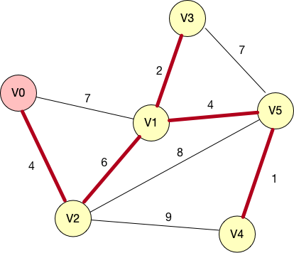
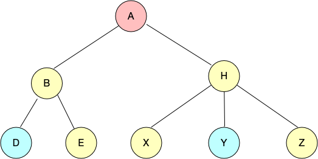

<!-- TOC -->

- [1. Priority queue](#1-priority-queue)
- [2. Heap](#2-heap)
- [3. HashMap](#3-hashmap)
- [4. Map](#4-map)
- [5. DFS & BFS](#5-dfs--bfs)
- [6. Prime & Kruskal](#6-prime--kruskal)
  - [summary(undirected weighted graph)](#summaryundirected-weighted-graph)
  - [Algorithm](#algorithm)
    - [image:](#image)
    - [Prime:](#prime)
    - [Kruskal(depends on union_find set):](#kruskaldepends-on-union_find-set)
- [7. Floyd & Dijkstra](#7-floyd--dijkstra)
  - [summary(directed weighted graph)](#summarydirected-weighted-graph)
  - [Floyd](#floyd)
  - [Dijkstra](#dijkstra)
- [8. Sorting](#8-sorting)
  - [8.1. Insert Sort](#81-insert-sort)
  - [8.2. Shell Sort](#82-shell-sort)
  - [8.3. Select Sort](#83-select-sort)
  - [8.4. Quick Sort](#84-quick-sort)
    - [8.4.1. Original Quick Sort](#841-original-quick-sort)
    - [8.4.2. Application](#842-application)
      - [8.4.2.1 Quick-SELECT Algorithm( find the kth-smallest number in O(n) )](#8421-quick-select-algorithm-find-the-kth-smallest-number-in-on-)
  - [8.5. Merge Sort](#85-merge-sort)
  - [8.6. Radix Sort](#86-radix-sort)
- [9. Container](#9-container)
  - [9.1. vector](#91-vector)
<!-- TOC -->

# 1. Priority queue
+ summary
    - priority_queue<Type, Container, Functional>，其中Type 为数据类型，Container为保存数据的容器，Functional 为元素比较方式。
    - Container必须是用**数组**实现的容器，比如vector,deque等等，**但不能用list**。STL里面默认用的是vector。
    - 比较方式默认用operator<，所以如果把后面2个参数缺省的话，优先队列就是**大顶堆（降序）**，队头元素最大。**特别注意pair的比较函数。**
+ priority_queue function:
    - normal type;
    ```
    #include <iostream>
    #include <queue>
    using namespace std;
    int main(){
    priority_queue<int> q;
    for(int i = 0; i < 10; ++i)
        q.push(i)
    }
    while(!q.empty()){
        std::cout<<q.top()<<" ";
        q.pop();
    }
    //output：
    //9 8 7 6 ...  0
    return 0;
    }
    ```
    - pair<> type;
    ```
    //先按照pair的first元素降序，first元素相等时，再按照second元素降序：
    #include<iostream>
    #include<vector>
    #include<queue>
    using namespace std;
    int main(){
    priority_queue<pair<int,int> > coll;
    pair<int,int> a(3,4);
    pair<int,int> b(3,5);
    pair<int,int> c(4,3);
    coll.push(c);
    coll.push(b);
    coll.push(a);
    while(!coll.empty())
    {
        cout<<coll.top().first<<"\t"<<coll.top().second<<endl;
        coll.pop();
    }
    // output:
    //  4	3
    //  3	5
    //  3	4
    return 0;
    }
    ```
    - make ascending order(最小堆)
    ```
    #include <iostream>
    #include <queue> 
    using namespace std;
    int main(){
    priority_queue<int, vector<int>, greater<int> > q;
    for( int i= 0; i< 10; ++i ) q.push(10-i);
    while( !q.empty() ){
        cout << q.top() << " ";
        q.pop();
    }
    // output：
    //1 2 3 ... 10
    return 0;
    }


    ///
    #include<iostream>
    #include<vector>
    #include<queue>
    using namespace std;
    int main(){
    priority_queue<pair<int,int>,vector<pair<int,int> >,greater<pair<int,int> > > coll;
    pair<int,int> a(3,4);
    pair<int,int> b(3,5);
    pair<int,int> c(4,3);
    coll.push(c);
    coll.push(b);
    coll.push(a);
    while(!coll.empty())
    {
        cout<<coll.top().first<<"\t"<<coll.top().second<<endl;
        coll.pop();
    }
    return 0;
    }
    ```
    - customized type;

    ```
    #include <iostream>
    #include <queue> 
    using namespace std;
    struct Node{
        int x, y;
        Node(int a=0, int b=0):
            x(a),y(b){}
    };
    //自定义类型重载operator<后，声明对象时就可以只带一个模板参数。
    bool operator<(Node a, Node b){//返回true时，说明a的    优先级低于b
        //x值较大的Node优先级低（x小的Node排在队前）
        //x相等时，y大的优先级低（y小的Node排在队前）
        if( a.x== b.x ) return a.y> b.y;
        return a.x> b.x; 
    }
    int main(){
        priority_queue<Node> q;
        for( int i= 0; i< 10; ++i )
        q.push( Node( rand(), rand() ) );
        while( !q.empty() ){
            cout << q.top().x << ' ' << q.top().y << endl;
        q.pop();
      }
      ///output:
        // 424238335 1957747793
        // 846930886 1804289383
        // 1102520059 783368690
        // 1189641421 596516649
        // 1303455736 304089172
        // 1350490027 1025202362
        // 1540383426 1365180540
        // 1649760492 719885386
        // 1714636915 1681692777
        // 1967513926 2044897763
      return 0;
    }


    ////
    //重写仿函数的例子（返回值排序与2.3.1相同，都是小顶堆。先按x升序，x相等时，再按y升序
    #include <iostream>
    #include <queue>
    using namespace std;
    struct Node{
        int x, y;
        Node( int a= 0, int b= 0 ):
            x(a), y(b) {}
    };
    struct cmp{
        bool operator() ( Node a, Node b ){//默认是less函数
            //返回true时，a的优先级低于b的优先级（a排在b的后面）
            if( a.x== b.x ) return a.y> b.y;      
            return a.x> b.x; }
    };
    int main(){
        priority_queue<Node, vector<Node>, cmp> q;
        for( int i= 0; i< 10; ++i )
        q.push( Node( rand(), rand() ) );
        while( !q.empty() ){
            cout << q.top().x << ' ' << q.top().y << endl;
            q.pop();
        }
        return 0;
    }
    ```
+ practical application:
    - timer management;
+ theoretical analysis:
../doc/c++/data_structure.mdnel ../doc/c++/data_structure.mdre: ../doc/c++/data_structure.md

# 2. Heap
+  buildMaxHeap方法的流程简单概括起来就是一句话，从A.length / 2一直到根结点进行maxHeapify调整,花费时间 O(n)

```cpp
class MaxHeap{
public:
    MaxHeap(int * ar,int len);
    ~MaxHeap();

    int parent(int index);
    int lchild(int index);
    int rchild(int index);

    //from the first node which is not leaf
    void maxheapify(int * a,int index,int len);
    void buildmaxheap(int * a,int len); //O(n)
    void printheap(int *a,int len);
    void swap(int * a,int * b);

    void dynamicbuildmaxheap(int key); //O(nlgn)
    void heapincresekey(int index,int key);
    void printdyheap();

private:
    int *m_array;
    int m_len;
    std::vector<int>  m_vec;
    int m_heapsize;
};


MaxHeap::MaxHeap(int * ar,int len){
    m_array = new int[len];
    for(int i = 0; i < len; ++i){
        m_array[i] = ar[i];
    }
}
MaxHeap::~MaxHeap(){
    delete [] m_array;
}

int MaxHeap::parent(int index){
    return m_array[index/2];
}
int MaxHeap::lchild(int index){
    return m_array[index*2+1];
}
int MaxHeap::rchild(int index){
    return m_array[index*2+2];
}

//from the first node which is not leaf
void MaxHeap::maxheapify(int * a,int index,int len){
    int lindex = 2*index + 1;
    int rindex = 2*index + 2;
    int largest = index;
    while(true){
        if(lindex < len && m_array[lindex] > m_array[index]){
            largest = lindex;
        }
        if(rindex < len && m_array[rindex] > m_array[largest]){
            largest = rindex;
        }
        if(index != largest){
            swap(&m_array[index],&m_array[largest]);
        }else{
            break;
        }
        index = largest;
        lindex = 2 * index + 1;
        rindex = 2 * index + 2;
    }
}
void MaxHeap::buildmaxheap(int * a,int len){
    for(int i = len/2; i >= 0; i--){
        maxheapify(a,i,len);
    }
    std::cout<<"max heap is : ";
    printheap(m_array,len);
}

void MaxHeap::printheap(int *a,int len){
    for(int i = 0; i < len; ++i){
        std::cout<<m_array[i]<<" ";
    }
    std::cout<<std::endl;
}

void MaxHeap::swap(int * a,int * b){
    int temp = *a;
    *a = *b;
    *b = temp;
}

void MaxHeap::dynamicbuildmaxheap(int key){
    m_vec.push_back(key);
    m_heapsize++;
    int last_index = m_vec.size() - 1;
    heapincresekey(last_index,key);
}

void MaxHeap::heapincresekey(int index,int key){
    int parentindex = (index - 1)/2;
    while(parentindex >= 0 && m_vec[parentindex] < m_vec[index]){
        swap(&m_vec[parentindex],&m_vec[index]);
        index = parentindex;
        parentindex = (index-1)/2;
    }
}

void MaxHeap::printdyheap(){
    for(int i = 0; i < m_vec.size(); ++i){
        std::cout<<m_vec[i]<<" ";
    }
    std::cout<<std::endl;
}

int main(){
    int ar [] = {1,2,3,4,5,6,7,8,9};
    MaxHeap  mh(ar,9);
    mh.buildmaxheap(ar,9);
        //build heap dynamically
    for(int i = 1; i < 11; i += 2){
        mh.dynamicbuildmaxheap(i);
    }
    mh.printdyheap();
    return 0;
}
```

+ analysis:
    + conclusion 1:
        -  粗粗来看前面buildmaxheap的时间复杂度，每次maxHeapify调整需要的时间为lg(n), 总共要遍历的元素有N/2个，所以大致的运行时间复杂度为O(nlgn);
        - 如果我们更进一步分析，会发现它的实际情况会更理想一点。首先一个，我们从第a.length/2个元素开始执行maxHeapify，最开始这一层的元素只有一个子结点，也就是说，就算要调整，顶多一次就搞定了，不需要走lgn这么多步。
        - 我们看这棵二叉树，它必须保证每一层填满之后才能去填充下一层。而且，如果从根结点开始计数，往下第i层的元素如果不是最后一层的话，这一层的元素数量为$2^i$。这样，对于一棵高为h的二叉树，它的所有结点数目就等于前面完全填满的层元素加上最下面一层的元素。
        - 作为一棵高度为h的树，最下面一层的元素最少可以是1，最大可以是把整层填充满，也就是$2^{h+1}$。这样，他们求和的结果就是最少为$2^h$, 最大为 $2^{h+1}$.
        - 所以假设堆的元素数量为n的话，我们就可以推出：
    $$2^h <= n < 2^{h+1} -1 < 2^{h+1}$$
    $$h <= lgn < h+1$$
        - 我们可以发现一个n个元素的树，它的高度相当于|_lgn_|（向下取整）
    + conclusion 2:
        - 假设高度为1的那一层他们的元素个数为k，那么他们的访问时间复杂度为O(k)。根据前面的分析，我们还发现一个情况，就是如果从根结点开始计数，往下第i层的元素如果不是最后一层的话，这一层的元素数量为$2^i$。正好这个第i层就相当于树的总高度减去当前层的结点的高度。假设第i层的高度为h，那么也就是i = lgn - h。
        - 第i层的元素个数：
        $$2^{height - hi - 1} = 2^{lgn - hi - 1} = \frac{n}{2^{hi+1}}$$
        - total time:
        $$\sum_{hi=0}^{|lgn|}\frac{n}{2^{hi+1}}O(h) = O(n\sum_{hi=0}^{|lgn|}\frac{h}{2^h})$$
        $$\because F(n) = \sum_{h=0}^n \frac{h}{2^h} = (\frac{1}{2^1} + \frac{2}{2^2} + ... + \frac{n}{2^n})$$
        $$2F(n)=\sum_{h=0}^n \frac{h}{2^{h-1}} = (\frac{1}{2^0} + \frac{2}{2^1} + ... + \frac{n}{2^{n-1}})$$
        $$F(n) = 2F(n) - F(n)$$
        $$F(n) = 1 + \frac{1}{2^1}+\frac{1}{2^2} + ... + \frac{1}{2^{n-1}} - \frac{n}{2^n}$$
        $$F(n) = 1 + (1 - \frac{1}{2}^{n-1})- \frac{n}{2^n}$$
        $$\lim_{n \to \infty}F(n) = 2$$
        $$\therefore \sum_{hi=0}^{|lgn|}\frac{n}{2^{hi+1}}O(h) = O(n\sum_{hi=0}^{\infty}\frac{h}{2^h})=O(n)$$

+ dynamicbuildmaxheap方法是动态建立最大堆的方法，在不知道有多少元素的情况下，动态增加构建堆；
    - 1. 首先增加堆的长度，在最末尾的地方加入最新插入的元素。
    - 2. 比较当前元素和它的父结点值，如果比父结点值大，则交换两个元素，否则返回。
    - 3. 重复步骤2.
    - 我们先看最理想的情况，假设每次插入的元素都是严格递减的，那么每个元素只需要和它的父结点比较一次。那么其最优情况就是n。
    - 对于最坏的情况下，每次新增加一个元素都需要调整到它的根结点。而这个长度为lgn。那么它的时间复杂度为如下公式：
    $$\sum_{i=1}^{n}\Theta(|lgi|) = lg(n!)$$
    according to Stirling’s formula:
    $$\lim_{n \to \infty}\frac{n!}{\sqrt{2n\pi}\left(\frac{n}{e}\right)^n} = 1(等价无穷大)$$
    $$\lim_{n \to \infty}\frac{log(n!)}{log(n^n)} = \lim_{n \to \infty}\frac{log(\sqrt{2n\pi}\left(\frac{n}{e}\right)^n)}{nlog(n)}=\lim_{n \to \infty}\frac{\frac{1}{2}log(2\pi)+\frac{1}{2}log(n)+nlog(n)-nlog(e)}{nlog(n)}$$
    $$=\lim_{n \to \infty}(\frac{\frac{1}{2}log(2\pi)}{nlog(n)} + \frac{1}{2n} + 1 - \frac{1}{ln(n)}) = 1 $$
    $$\therefore \sum_{i=1}^{n}\Theta(|lgi|) = lg(n!) = nlg(n)$$

# 3. HashMap
- unordered_map

# 4. Map
- prototype:
```cpp
template <class Key,class T,
          class Compare = less<key>,
          class Alloc = alloc>
class map{
    ......
};
```


- customized key and how to find the key;
    + key can be pointer(only if you override 'operator < ') and can only be object ($critical$);
    ```cpp
   std::map<NHSymbolkey, Stru_NHSymbol>*   pmapNHSymbolInfo1

   std::map<NHSymbolkey, Stru_NHSymbol*>*  pmapNHSymbolInfo2
   
   std::map<NHSymbolkey*, Stru_NHSymbol*>*  pmapNHSymbolInfo3 

    ```

    + it needs to implement 'operator <' or pass UnaryPredicate or BinaryPredicate to map;
    + wrong way to implement 'operator <':
    ```cpp
    struct SomeKey{
        int a;
        int b;
    }
    //wrong !!!
    bool operator < (const SomeKey& right)
    {
        if (a < right.a) // 主key
        {
            return true;
        }
    
        if (b < right.b) // 次key
        {
            return true;
        }
        return false;
    }

    //wrong !!!
    bool operator< (const SomeKey & rValue) const {
         return a < rValue.a || b < rValue.b;
    }


    int main(){
        std::map<SomeKey, int> m;
        m.insert({ { 10, 20 }, 1 });
        m.insert({ { 5, 30 }, 2 });
        auto it = m.find({ 5, 30 });
        if (it == m.end())
        {
        	std::cout << "cannot find{5, 30}" << std::endl;   //enter into this branch
        }
        else
        {
        	std::cout << "found{5, 30}" << std::endl;
        }
        
        /////
        m.insert({ { 8, 25 }, 3 });
        it = m.find({ 5, 30 });
        if (it == m.end())
        {
        	std::cout << "找不到{5, 30}" << std::endl;
        }
        else
        {
        	std::cout << "找到{5, 30}" << std::endl;
        }
        return 0;
    }
    //output:
    cannot find {5,30};
    found {5,30};


    ////correct
    bool operator < (const SomeKey& right)
    {
        if (a < right.a) // 主key
        {
            return true; // 主key小，就小
        }
        if (a > right.a) // 主key
        {
            return false; // 主key大，就大
        }
        return b < right.b; // 主key相等，再比较次key
    }
    ```
    + analysis: 
     when m.insert({ { 5, 30 }, 2 });是以被插入值（后称目标值）和红黑树上的节点（后称节点值）比较;
        

     而在map表中find时，是以节点值和目标值进行比较;
        
        因为{10, 20} < {5, 30}，所以在{10, 20}的右子树上查找，自然就找不到了。
    然后再次插入一个节点;因为{8, 25} < {10, 20}，继续{8, 25} < {5, 30}，最终{8, 25}插入到map表的最左子节点，破坏了红黑树的平衡，右旋后，整棵树变成:
    
    然后在表中find {5, 30}，首先找到第一个不小于{5, 30}的节点，因为第一个节点值{5, 30} 不小于目标值{5, 30}，而目标值{5, 30}也不小于该节点值{5, 30}，于是就找到了目标值。这种怪异行为导致的bug是比较隐秘的：你在表中找一个值，时而找得到，时而又找不到。

    ```cpp
    #include <iostream>
    #include <map>
    #include <string>

    using namespace std;
    //solution 1:
    struct AttrSubKey{
        string clientID;
        string instrumentID;
        int TID;

        bool operator< (const AttrSubKey & rValue) const {
            if(clientID < rValue.clientID){
                return true;
            }
            if(clientID > rValue.clientID){
                return false;
            }
            if(instrumentID < rValue.instrumentID){
                return true;
            }
            if(instrumentID > rValue.instrumentID){
                return false;
            }
            return TID < rValue.TID;
        }
    };

    typedef map<AttrSubKey,int> T_AttrSubMap;

    //solution 2 (also you can inherit unary_function):
    class AttrSubSetLessPred : public binary_function<AttrSubKey,AttrSubKey,bool>{
        public:
        bool operator() (const AttrSubKey & lValue,const AttrSubKey & rValue) const {
            return lValue.TID < rValue.TID || lValue.clientID < rValue.clientID || lValue.instrument < rValue.instrumentID;
        }
    }

    typedef map<AttrSubKey,int,AttrSubSetLessPred> T_AttrSubMap;

    /////////////
    struct COrder{
    double LimitPrice;
    long Priority;
    long TimeSortID;
    long ImplySortID;
    char Direction;
    };
    class BuyOrderBookLessPred : public std::binary_function<COrder *,COrder*,bool>{
        public:
        bool operator() (const COrder * lValue,const COrder * rValue) const;
    };

    typedef std::map<COrder *,int,BuyOrderBookLessPred> TBuyOrderBook;

    ////3 ways to implement operator()
    ///1
    bool BuyOrderBookLessPred::operator() (const COrder * lValue,const COrder * rValue) const{
        if(lValue->LimitPrice > rValue->LimitPrice){
            return true;
        }
        if(lValue->LimitPrice < rValue->LimitPrice){
            return false;
        }
        if(lValue->Priority > rValue->Priority){
            return true;
        }
        if(lValue->Priority < rValue->Priority){
            return false;
        }
        if(lValue->TimeSortID < rValue->TimeSortID){
            return true;
        }
        if(lValue->TimeSortID > rValue->TimeSortID){
            return false;
        }
        return lValue->ImplySortID < rValue->ImplySortID;
    }


        //2
    bool BuyOrderBookLessPred::operator() (const COrder * lValue,const COrder * rValue) const{
        if(lValue->LimitPrice != rValue->LimitPrice){
            return lValue->LimitPrice > rValue->LimitPrice;
        }
        if(lValue->Priority != rValue->Priority){
            return lValue->Priority > rValue->Priority;
        }
        if(lValue->TimeSortID != rValue->TimeSortID){
            return lValue->TimeSortID < rValue->TimeSortID;
        }
        if(lValue->ImplySortID != rValue->ImplySortID){
            return lValue->ImplySortID < rValue->ImplySortID;
        }
        return false;
    }


        //3
    bool BuyOrderBookLessPred::operator() (const COrder * lValue,const COrder * rValue) const{
        if(lValue->LimitPrice > rValue->LimitPrice){
            return true;
        }else if(lValue->LimitPrice == rValue->LimitPrice && lValue->Priority > rValue->Priority){
            return true;
        }else if(lValue->Priority == rValue->Priority && lValue->TimeSortID < rValue->TimeSortID){
            return true;
        }else if(lValue->TimeSortID == rValue->TimeSortID && lValue->ImplySortID < rValue->ImplySortID){
            return true;
        }else{
            return false;
        }
    }
    

    int main(){
        T_AttrSubMap mm;
        AttrSubKey object;
        object.clientID = "zhaojx";
        object.instrumentID = "BTC";
        object.TID = 20;
        mm[object] = 1;

        object.clientID = "stl";
        object.instrumentID = "ETH";
        object.TID = 25;
        mm[object] = 2;

        auto it = mm.find(tmp);
        if(it != mm.end()){
            std::cout<<"found"<<std::endl;
        }else{
            std::cout<<"not found"<<std:endl;
        }
        /////
        
        
    }
    ```

 - map插入数据2中方式比较  
    std::map<NHSymbolkey, Stru_NHSymbol*>*  pmapNHSymbolInfo
      + pmapNHSymbolInfo->insert(std::make_pair(pNHSymbolkey, pNHSymbol));该方式的key如果出现重复，则会插入数据失败；
      + (*pmapNHSymbolInfo)[objNHSymbolkey] = pNHSymbol;该方式的key如果出现重复则直接覆盖掉原来的数据，永远不会出现插入失败的问题。

# 5. DFS & BFS

# 6. Prime & Kruskal
## summary(undirected weighted graph)
+ shortest path is called minimum spanning tree(MST)
+ Prime$(O(n^{2}))$
+ Kruskal$( O(eloge) )$
## Algorithm
### image:

### Prime:
+ Prime Algorithm:
    
    + Step:
        - prime is DFS algorithm actually;
        - start from "$V0$",mark "$V0$" as visited;
        - find the nearest vertice to "$V0$"-->"$V2$",mark "$V2$" as visited;
        - start from "$V2$",find the nearest vertice to "$V2$"-->"$V1$",mark "$V1$" as visited;
        - start from $"V1"$,find the nearest vertice to "$V1$"-->"$V3$",mark "$V3$" as visited;
        - traverse distance array which record the shortest edge to current vertice,it can be found that $dis[V5] = 4$ and "$V5$" has never been visited,mark "$V5$" as visited;
        - start from "$V5$",find the nearest vertice to "$V5$"-->"$V4$";
    + source code:
    ```cpp
    int UnDirectedWeightAlgorithm::Prime(int cur) {
    int index;
    int sum = 0;
    m_visited[cur] = true;
    for(int i = 0; i < N; ++i){
        dist[i] = graph[cur][i];
    }

    for(int i = 1; i < N; ++i){
        int mincost = INF;
        for(int j = 0; j < N; ++j){
            if(!m_visited[j] && dist[j] < mincost){
                mincost = dist[j];
                index = j;
            }
        }

        m_visited[index] = true;
        sum += mincost;
        for(int j = 0; j < N; ++j){
            int s = graph[index][j];
            if(!m_visited[j] && dist[j] > graph[index][j]){
                dist[j] = graph[index][j];
            }
        }
    }
    return sum;
    }
    ```

### Kruskal(depends on union_find set):
+ Union-find Set:
    - concept:
        - union_find set: tree structure,if two nodes have common ancestor,then there's no edge between then, or it results in loop path;
        - algorithm:
            - find: find ancestor node of current nodes to see whether the two nodes have common ancestor;
            - union: if the two nodes have different ancestors,then union them to one set;
        - classification:
            - union_set image:
            
            - (I) union by rank:
                - unio "D" and "Y",first find ancestor of D-->"A",then find ancestor of Y-->"H";union H to A(always union low rank tree to high rank tree);
                rank(depth) remains 2;
                - left tree's rank(depth)=2, right tree's rank(depth)=1; new tree's rank remains stable(rank = 2) when union two trees ; if two trees' ranks are equal,then new tree's rank = rank + 1;
                
                - source code:
                ```cpp
                void UnDirectedWeightAlgorithm::make_set(){
                for (int i = 0; i < N; ++i){
                    m_father[i] = i;
                    m_rank[i] = 1;
                }
                return;
                }

                int UnDirectedWeightAlgorithm::find_set(int x){
                if (x != m_father[x]){
                    m_father[x] = find_set(m_father[x]);
                    }
                    return m_father[x];
                }

                void UnDirectedWeightAlgorithm::union_set(int x,int y){
                    x = find_set(x);
                    y = find_set(y);
                    if(x == y)
                        return;
                    if(m_rank[x] < m_rank[y]){
                        m_father[x] = find_set(y);
                    }else{
                        if(m_rank[x] == m_rank[y]){
                            m_rank[x] ++;
                        }
                        m_father[y]  = find_set(x);
                    }
                    return;
                }

                ```
            - (II) union with path compressing:
                - ensure each subtree's depth is 1 before unioning two trees;
                - 
                - source code:
                ```cpp
                int UnDirectedWeightAlgorithm::find_set_c(int x){
                    int r = x;
                    while(m_father[r] != r){
                        r = m_father[r];
                    }
                    int i = x;
                    int j = 0;
                    while(m_father[i] != r){
                        j = m_father[i];
                        m_father[i] = r;
                        i = j;
                    }
                    return r;
                }

                void UnDirectedWeightAlgorithm::union_set_c (int x,int y)
                {
                    int fx = find_set_c(x);
                    int fy = find_set_c(y);
                    if(fx != fy){
                        m_father[fx] = fy;
                    }
                }
                ```
+ Kruskal Algorithm:
                    
    - find from the shortest edge,then add into union-find set;
    
    - union by rank:
        - image:
        
    - union with path compressing:
        - image:
        

# 7. Floyd & Dijkstra
## summary(directed weighted graph)
+ Floyd: no negative ring(more extensive than Dijkstra), $O(n^{3})$;
+ Dijkstra(without negative edge),$O(n^{2})$
+ Bellman

## Floyd
+ to nake the shortest path between "a" & "b",you can introduce the other point k which is between "a" & "b", path like this: a->k->b,what we need to do is to find these k points
+ init status:


+ it can only pass point "1",then update the matrix:

+ comment: to find the shortest path between 3 & 2;
    + [3->2] is inited as infinity;
    + [3->2] can be transfered to [3->1->2];
    + [2->1: 2] + [1->3: 7] = 9 < &;
    + [3->2] = 9;

+ it can only pass point "1" & "2",then update the matrix:

+ comment: to find the shortest path between 1 & 3;
+ [1->3] is inited as "6";
+ [1->3] can be transfered to [1->2->3];
+ [1->2: 2] + [2->3: 3] = 5 < 6;
+ [1->3] = 5;

## Dijkstra


# 8. Sorting
| SortName | Stability | AverageTime | BestTime | WorstTIme |
| ------ | ------ | ------ | ------ | ------ |
| InsertSort | Stable |  $O(n^{2})$ | $O(n)$ | $O(n^{2})$ |
| ShellSort | Stable |  $O(n^{1.5})$ | $O(n)$ | $O(n^{1.5})$ |
| SelectSort | Stable |  $O(n^{2})$ | $O(n^{2})$ | $O(n^{2})$ |
| QuickSort | Stable |  $O(nlogn)$ | $O(nlogn)$ | $O(n^{2})$ |
| MergeSort | Stable |  $O(nlogn)$ | $O(nlogn)$ | $O(nlogn)$ |
| RadixSort | Stable |  $O(nlogn)$ | $O(nlogn)$ | $O(nlogn)$ |

## 8.1. Insert Sort
+ scenario: it's applied when data are almost sorted or with small scale;
## 8.2. Shell Sort
+ scenario: it's applied when data scale >= medium

## 8.3. Select Sort
## 8.4. Quick Sort 
+ 如果快速排序每次都将数据分成相等的两部分，则快排的时间复杂度和归并排序相同，也是 O（nlogn），但这种情况是很难实现的。如果数据原来已经是有序的，则每次的分区都是不均等的，我们需要进行 n 次分区才能完成整个排序，此时快排的时间复杂度就退化成了 $O(n^2)$。
+ 平均时间复杂度的求解也可以通过递归树来分析，这个问题留待我们以后再解决。我们现在只需要知道，在大部分情况下，快速排序的时间复杂度都可以做到 O(nlogn)，只有在极端情况下，才会退化成 $O(n^2)$。
+ 快速排序是一个原地排序算法，是一个不稳定的排序算法，因为其在数据交换过程中可能会改变相等元素的原始位置。
### 8.4.1. Original Quick Sort
### 8.4.2. Application
#### 8.4.2.1 Quick-SELECT Algorithm( find the kth-smallest number in O(n) )
+ first we should make clear the formulars below:
    $$ x - 1 < \lfloor{x}\rfloor <= x <= \lceil{x}\rceil < x + 1$$
    $$ \lfloor\frac{n}{2}\rfloor + \lceil\frac{n}{2}\rceil = n $$
+ the algorithm's time complexity is O(n) at worst. the steps below( find the ith smallest element ):
    - 1. divide the input array which contains n elements into $\lfloor\frac{n}{5}\rfloor$ groups, leave only one group which contains n mod 5 elements; //O(1)
    - 2. find each group's median: 
        - You're ought to sort the elements in each group( normally use insert sort algorithm) in advance;
        - then you can find the median in each sorted group; //O(n)
    - 3. find the median(x) of the medians found in step 2( if number of the medians is even,we return the smaller one );
    - 4. make the final median be the pivot of the array,use PARTITION function to divide the array, the "k" = (number of the low section) + 1,so the x is the kth smallest number,and there's n-k elements in the high section;
    - 5. if i = k; return x;
         if x < k,call SELECT algorithm in the low section recursively to find the ith smallest element;
         if x > k, call SELECT algorithm in the high section recursively to find the (i-k)th smallest element;

    Analysis:
    

    as can be seen from the png, there's half of the groups which has 3 elements greater than x at least except for the 2 groups(the group containing x and the last group);
    so the number of elements greater than x:
    $$ 3 * (\lceil{\frac{1}{2}*\lceil\frac{n}{5}\rceil}\rceil - 2) >= \frac{3n}{10} - 6$$, analogously the number of elements less than x is $ \frac{3n}{10} - 6$;
    so the number of elements step '5' calls SELECT algorithm on is: $$ n - (\frac{3n}{10} - 6) = \frac{7n}{10} + 6$$

    Now we can write down the time cost below:
    + step '1','2','4' cost O(n);
    + step '3' cost $T(\lceil\frac{n}{5}\rceil)$
    + step '5' cost $T(\frac{7n}{10}+6)$

    $$T(n) <= {\begin{cases} O(1) \qquad\ n < 140\\T(\lceil\frac{n}{5}\rceil) + T(\frac{7n}{10}+6) + O(n) \qquad\ n>= 140 \end{cases}} $$
    why the magic number is 140?
    we'll prove that for some constant c,and n>0, T(n) <= cn is always true;
    [**Prove**]:
       first: Providing there's some constant c and n < 140,T(n) <= cn is obiviously true;
       second: Providing there's some constant a,O(n) has upper bound 'an' ,O(n) <= an
       $$T(n) <= c*\lceil\frac{n}{5}\rceil + c(\frac{7n}{10}+6) + an$$
       $$<= \frac{cn}{5}+c + \frac{7cn}{10} + 6c + an$$
       $$ = \frac{9cn}{10} + 7c + an$$
       $$ = cn + (\frac{-cn}{10} + 7c + an)$$
    if the formular above is true( T(n) <= cn ):
        $$\frac{-cn}{10} + 7c + an <= 0$$
    when n > 70,
        $$c >= \frac{10an}{n-70}$$
    cause we have the condition that n >= 140;
        $$\frac{n}{n-70} >= 2$$
        $$=> c >= 20a $$
    only of c >= 20, we can prove that T(n) <= cn, and the '140' can be any number greater than 70

+ However what if the divisor is '3' instead of '5',Could the time complexity be **O(n)** ?
    the answer is no!! (the divisor must be greater than 5)


## 8.5. Merge Sort

$$ = 2*[2*T(\frac{n}{4}) + \frac{n}{2}] + n = 4*T(\frac{n}{4}) + 2*n $$
$$ = 4*[2*T(\frac{n}{8}) + \frac{n}{4}] + 2*n = 8*T(\frac{n}{8}) + 3*n $$
$$ ......$$
$$ = 2^k * T(\frac{n}{2^k}) + k * n$$
$$ ......$$
+ 从我们的分析可以看出，归并排序的执行效率与原始数据的有序程度无关，其时间复杂度是非常稳定的，不管是最好情况、最坏情况，还是平均情况，时间复杂度都是 O(nlogn)。
+ 归并排序有一个缺点，那就是它不是原地排序算法。在进行子数组合并的时候，我们需要临时申请一个数组来暂时存放排好序的数据。因为这个临时空间是可以重复利用的，因此归并排序的空间复杂度为O(n)，最多需要存放n个数据。
## 8.6. Radix Sort


# 9. Container
## 9.1. vector
+ 'delete' action in vector by iterator
+ C++ vector 容器利用类似于数组的连续内存空间来存储其元素，当利用其e r a s e eraseerase函数删除相应的元素之后，该容器会重新分配所有剩下的元素，同时e r a s e eraseerase函数会返回指向已经删除的那些元素的下一个元素的迭代器，以前所有指向被删除元素以后的元素的迭代器会失效.
  ```cpp
  //error
  void del_vec(){
      vector<int> myvector;
      for(int i = 1; i <= 7; ++i){
          myvector.push_back(i);
      }
      for(auto it = myvector.begin(); it != myvector.end(); ++it){
          if(*it > 3){
              myvector.erase(it);
          }
      }
  }

  //right
  void del_vec(){
      vector<int> myvector;
      for(int i = 1; i <= 7; ++i){
          myvector.push_back(i);
      }
      for(auto iter = myvector.begin(); iter != myvector.end();){
          if(*iter > 3){
              iter = myvector.erase(iter);
          } else {
              iter++;
          }
      }
  }
  ```
