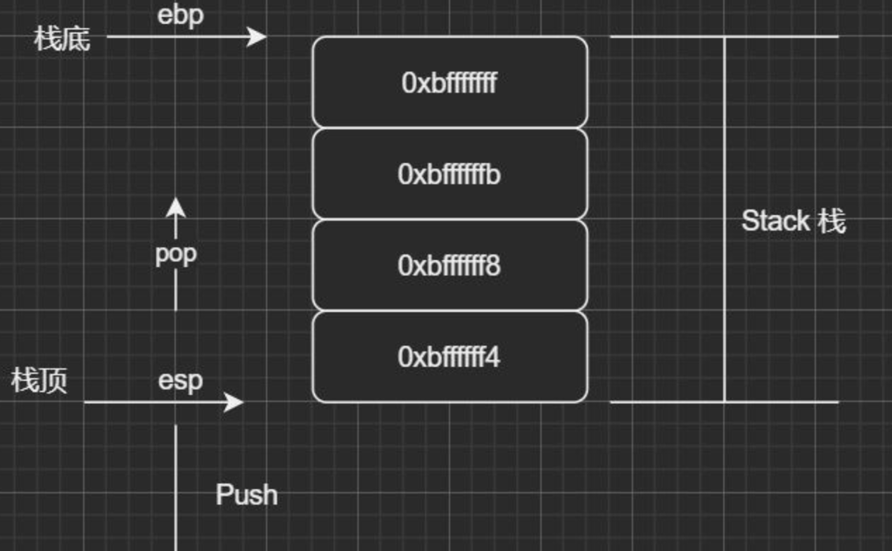

[toc]

---


# 1. timer
## simple timer
+ sleep:
    - 其中sleep精度是1秒，usleep精度是1微妙，具体代码就不写了。使用这种方法缺点比较明显，在Linux系统中，sleep类函数不能保证精度，尤其在系统负载比较大时，sleep一般都会有超时现象。
+ SIGALRM+alarm():
    - 这种方式的精度能达到1秒，其中利用了*nix系统的信号量机制，首先注册信号量SIGALRM处理函数，调用alarm()，设置定时长度，代码如下：
```cpp
#include <stdio.h>  
#include <signal.h>  
  
void timer(int sig)  
{  
        if(SIGALRM == sig)  
        {  
                printf("timer\n");  
                alarm(1);       //we contimue set the timer  
        }  
  
        return ;  
}  
  
int main()  
{  
        signal(SIGALRM, timer); //relate the signal and function  
  
        alarm(1);       //trigger the timer  
  
        getchar();  
  
        return 0;  
}  
缺点： 无法实现低于1秒的精度
```


+ RTC机制
    - 利用系统硬件提供的Real Time Clock机制，通过读取RTC硬件/dev/rtc,通过iocl()设置RTC频率：
```cpp
#include <stdio.h>  
#include <linux/rtc.h>  
#include <sys/ioctl.h>  
#include <sys/time.h>  
#include <sys/types.h>  
#include <fcntl.h>  
#include <unistd.h>  
#include <errno.h>  
#include <stdlib.h>  
  
int main(int argc, char* argv[])  
{  
        unsigned long i = 0;  
        unsigned long data = 0;  
        int retval = 0;  
        int fd = open ("/dev/rtc", O_RDONLY);  
  
        if(fd < 0)  
        {  
                perror("open");  
                exit(errno);  
        }  
  
        /*Set the freq as 4Hz*/  
        if(ioctl(fd, RTC_IRQP_SET, 1) < 0)  
        {  
                perror("ioctl(RTC_IRQP_SET)");  
                close(fd);  
                exit(errno);  
        }  
        /* Enable periodic interrupts */  
        if(ioctl(fd, RTC_PIE_ON, 0) < 0)  
        {  
                perror("ioctl(RTC_PIE_ON)");  
                close(fd);  
                exit(errno);  
        }  
  
        for(i = 0; i < 100; i++)  
        {  
                if(read(fd, &data, sizeof(unsigned long)) < 0)  
                {  
                        perror("read");  
                        close(fd);  
                        exit(errno);  
  
                }  
                printf("timer\n");  
        }  
        /* Disable periodic interrupts */  
        ioctl(fd, RTC_PIE_OFF, 0);  
        close(fd);  
  
        return 0;  
}  
```

+ slect()
    - 通过使用select()，来设置定时器；原理利用select()方法的第5个参数，第一个参数设置为0，三个文件描述符集都设置为NULL，第5个参数为时间结构体:
```cpp
#include <sys/time.h>  
#include <sys/select.h>  
#include <time.h>  
#include <stdio.h>  
  
/*seconds: the seconds; mseconds: the micro seconds*/  
void setTimer(int seconds, int mseconds)  
{  
        struct timeval temp;  
  
        temp.tv_sec = seconds;  
        temp.tv_usec = mseconds;  
  
        select(0, NULL, NULL, NULL, &temp);  
        printf("timer\n");  
  
        return ;  
}  
  
int main()  
{  
        int i;  
  
        for(i = 0 ; i < 100; i++)  
                setTimer(1, 0);  
  
        return 0;  
}  
```


## timer in project
+ 在开发高性能服务器中，定时器总是不可或缺的。 常见的定时器实现三种，分别是：
**排序链表，最小堆，时间轮。** 最小堆:在定时器数量不多时可以使用;
目前公司用的框架中的定时器是基于简单时间轮的，但是为了支持大范围的时间，每个齿轮的所维护的链表为有序链表，每次插入时先mod出spoke，再从头遍历链表以便将定时器插入到合适位置， 所以本质上还是基于有序链表的。时间复杂度并未减少。


# 2. getUseFlag
## 
```cpp

#define R_INSERT 0
#define R_UPDATE 1
#define R_CANCEL 2
#define R_USELESS 3

#define INSERT (1<<R_INSERT)
#define UPDATE (1<<R_UPDATE)
#define CANCEL (1<<R_CANCEL)

int getUse(){
    int result = 0;
    result |= R_INSERT;
    result |= R_UPDATE;
    result |= R_CANCEL;
    return result;
}

int use = getUse();
for(int i= 0; i < R_USELESS;i++){
    if(use & (1<<i)){
        //means this rule is in use;
        rules[i].push_back(thisRuleUser);
    }
}

```


# 3. vsprintf
- usage:

```cpp
        #include <stdio.h>
        #include <stdarg.h>

        char buffer[50];
        int vspfunc(char * format, ...){
                va_list aptr;
                int ret;

                va_start(aptr,format);
                ret = vsprintf(buffer,format,aptr);
                va_end(aptr);

                return ret;
        }

        int main(){
                int i = 5;
                float f = 27.0;
                char str[50] = "baidu.com";
                vspfunc("%d %f %s",i,f,str);
                printf("%s\n",buffer);

                return 0;
        }

        //output
        5 27.00000 baidu.com
```

# 4. gdb
### 堆栈信息显示问号
+ 关键的core线程，堆栈显示为问号，应该是堆栈的内存被程序破坏了。
  
   - 图中只画了一个栈帧，在gdb中可以通过frame命令查看。
   - 栈顶的地址是小地址，栈底的地址是大地址。
   - ebp和esp之间的栈帧即是一次调用。64位系统ebp已经改成rbp，esp改成rsp。

+ 栈的内容主要包括局部变量、寄存器，参数返回地址，大致排列如下:
  

   下面看一段会引起coredump的代码:
   ```cpp
   #include <stdio.h>
   #include <stdlib.h>
   
   void g() {
       int *p = 0;
       long a = 0x1234;
       printf("%p %x\n", &a, a);
       printf("%p %x\n", &p, p);
       *p = 1;
   }
  
   void b(int argc, char **argv) {
      printf("%p %p\n", &argc, &argv);
      g();
   }
  
   int main(int argc, char **argv) {
      b(argc, argv);
      return 0;
   }
   ```
   编译调试如下:
   ```cpp
   (gdb) b g
   Breakpoint 1 at 0x4005f5: file testsp.c, line 5.
   (gdb) r
   Starting program: /home/miaohq/testcode/test 
   0x7fffffffe00c 0x7fffffffe000
   Breakpoint 1, g () at testsp.c:5
   5	    int *p = 0;
   Missing separate debuginfos, use: debuginfo-install glibc-2.17-196.el7_4.2.x86_64 libgcc-4.8.5-39.el7.x86_64 libstdc++-4.8.5-39.el7.x86_64
   (gdb) p $rsp
   $14 = (void *) 0x7fffffffdfe0
   (gdb) p $rbp
   $15 = (void *) 0x7fffffffdff0
   (gdb) p &p
   $16 = (int **) 0x7fffffffdfe8
   (gdb)  x/8ag $rsp
   0x7fffffffdfe0:	0x0	0x7ffff7ffe150
   0x7fffffffdff0:	0x7fffffffe010	             0x400673 <b(int, char**)+46>
   0x7fffffffe000:	0x7fffffffe118	             0x100000000
   0x7fffffffe010:	0x7fffffffe030	             0x400695 <main(int, char**)+32>
   (gdb) p &a
   $21 = (long *) 0x7fffffffdfe0
   (gdb) p &p
   $22 = (int **) 0x7fffffffdfe8
   (gdb) x/1ag 0x7fffffffdfe8
   0x7fffffffdfe8:	0x7ffff7ffe150
   (gdb) x/1ag 0x7fffffffdff0
   0x7fffffffdff0:	0x7fffffffe010
   (gdb) x /1ag 0x7fffffffe000
   0x7fffffffe000:	0x7fffffffe118
   (gdb) x /1ag 0x7fffffffe010
   0x7fffffffe010:	0x7fffffffe030
   (gdb) x/1ag 0x7fffffffdff8
   0x7fffffffdff8:	0x400673 <b(int, char**)+46>
   (gdb)  x /1ag 0x7fffffffe018
   0x7fffffffe018:	0x400695 <main(int, char**)+32>
   ```

   这里的x/8ag表示按十六进制格式显示变量方式，显示8个8字节的内存内容。
   ```cpp
   gdb 的x命令，很少用，却很重要，格式：x /<n/f/u> n是一个正整数，需要显示的内存单元个数，一个内存单元大小由u来决定，f标识显示格式。 u包括：b:1 byte h:2 bytes w:4 bytes g:8 bytes 如：x/3uh 0x54320 表示从0x54320地址开始，以h双字节位内存单位，u是16进制的无符号整数显示。
   ```
   
   函数调用过程：
   ```cpp
   (gdb) disassemble g
   Dump of assembler code for function g():
   0x00000000004005ed <+0>:	push   %rbp
   0x00000000004005ee <+1>:	mov    %rsp,%rbp
   0x00000000004005f1 <+4>:	sub    $0x10,%rsp
   => 0x00000000004005f5 <+8>:	movq   $0x0,-0x8(%rbp)
   0x00000000004005fd <+16>:	movq   $0x1234,-0x10(%rbp)
   0x0000000000400605 <+24>:	mov    -0x10(%rbp),%rdx
   0x0000000000400609 <+28>:	lea    -0x10(%rbp),%rax
   ```
   调用开始：

   把push %rbp即把老的rbp压入到栈中，这个可以在返回的时候恢复。
   sub $0x10,%rsprsp 下移即分配栈空间为16个字节和我们预期相符和。
   分配局部变量的空间，且赋值。 再看看g函数结尾：
   ```cpp
   0x000000000040062f <+66>:	mov    $0x0,%eax
   0x0000000000400634 <+71>:	callq  0x4004d0 <printf@plt>
   0x0000000000400639 <+76>:	mov    -0x8(%rbp),%rax
   0x000000000040063d <+80>:	movl   $0x1,(%rax)
   0x0000000000400643 <+86>:	leaveq 
   0x0000000000400644 <+87>:	retq
   ```
   其中: leaveq相当于:
   movq %rbp, %rsp
   popq %rbp
   所做的动作:
   
   将%rbp的值赋值给%rsp即弹出这个函数的调用栈帧。
   弹出栈顶现在位置的值给%rbp 在g函数中这个地址为：b:rbp位置即地址：0x7fffffffe010

   

#### 如何解决堆栈问号尼
   如果因为程序的错误破坏了栈，但是有个地方数据不会破坏那就是寄存器的值，所以我们可以通过 打印rbp和rsp的值得到了最后调用栈的栈底和栈顶，但是这个这两个地址间的数据可能被破坏了，怎么办那，那就是以此地址为基准，继续对上找，就会找到其他函数的栈信息。 使用到的命令如下：
   ```cpp
   (gdb) p $rbp
   $40 = (void *) 0x7fffffffdff0
   (gdb) p $rsp
   $41 = (void *) 0x7fffffffdfe0
   (gdb) x /8ag $rbp
   0x7fffffffdff0:	0x7fffffffe010	   0x400673 <b(int, char**)+46>
   0x7fffffffe000:	0x7fffffffe118	   0x100000000
   0x7fffffffe010:	0x7fffffffe030	   0x400695 <main(int, char**)+32>
   0x7fffffffe020:	0x7fffffffe118	   0x100000000
   (gdb)
   ```
   这样我们知道了，前面的调用栈原来是通过main函数调用到b函数，接着再调用到我们core的函数，从而定位core的大概位置。
   
# 5. systemlink
+ 程序构建一般需要经历：预处理、编译、汇编、链接。其中链接链的就是目标文件(.o文件), 他和可执行文件的内容和结构很相似，格式几乎是一样的，可以堪称是同一种类型的文件，Linux下统称为ELF文件，以下是ELF文件标准：
    - 可重定位文件：Linux中的.o,这类文件包含代码和数据，可被链接成可执行文件或共享目标文件，比如静态链接库。
    - 可执行文件：可以直接执行的文件，如/bin/bash文件。
    - 共享目标文件：Linux中的so，包含代码和数据。
    - core dump文件：进程意外终止时，系统可以将该进程的地址空间的内容和其他信息存到coredump文件用于调试。
可以通过file指令查看文件格式：
    ```shell
    ]# file test_epoll
    # output:
    # test_epoll: ELF 64-bit LSB executable, ARM aarch64, version 1 (SYSV), dynamically linked, interpreter /lib/ld-linux-aarch64.so.1, for GNU/Linux 3.7.0, BuildID[sha1]=66f3852255c1242ff2cdbf0bb6ce1177d398538b, not stripped
    ```
+ 目标文件构成：文件头、代码段、数据段、其他
    - 文件头：描述整个文件的文件属性(文件是否可执行、是静态链接还是动态链接、入口地址、目标硬件、目标操作系统等信息); 还包括段表，用来描述文件中各个段的数组，描述文件中各个段在文件中的偏移位置和段属性。
    - 代码段：程序源代码遍以后的机器指令。
    - 数据段：分为.data段和.bss段。
        - .data段内容：已经初始化的全局变量和局部静态变量，static声明的变量也存储在数据段，属于静态内存分配。
        【注意】初始化为0的全局变量还是被保存在BSS段。
        - .bss段内容：未初始化的全局变量和局部静态变量，(.bss段只是为未初始化的全局变量和局部静态变量预留位置，本身没有内容，不占用空间)。
    - 其他还包括.rodata段、.comment、字符串表、符号表、堆栈提示段等等，还可以自定义段。
    - .rodata段(read-only-data) - 常量区；比如程序中定义为const的全局变量，#define定义的常量，以及诸如"Hello World"的字符串常量。只读数据，存储在ROM中。
    【注意】const修饰的全局变量在常量区；const修饰的局部变量只是为了防止修改，没有放入常量区。编译器会去掉重复的字符串常量，程序的每个字符串常量只有一份，有些系统中rodata段是多个进程共享的，目的是为了提高空间利用率。

    下面的程序验证了.bss段不占磁盘空间，.bss段占据的大小存放在ELF文件格式中的段表(Section Table)中，段表存放了各个段的各种信息，比如段的名字、段的类型、段在elf文件中的偏移、段的大小等信息。同时符号存放在符号表.symtab中。当文件加载运行时，才分配空间以及初始化。
    ```cpp
    // file: test_link.c
    #include <stdio.h>
    
    int a[1000];
    int b[1000] = {1};

    int main() {
        printf("test\n");
        return 0;
    }
    
    // ]# gcc test_link.c -o test
    // ]# size test
    // output:
    // text  data  bss  dec  hex  filename
    // 1512  4616  4032 10160 27b0 test

    // 如果将上述代码:
    // int a[1000]改成：
    // int a[1000] = {1};

    // ]# gcc test_link.c -o test
    // ]# size test
    // output:
    // text  data  bss  dec  hex  filename
    // 1512  8616  8   10136 2798 test


    // 还可以自定义段
    __attribute__((section("Custom"))) int global = 1;
    // 通过readelf查看文件头信息
    // ]# readelf -h test.o
    // ]# readelf -S test.o 查看所有段信息

    // 使用objdump查看ELF文件中包含的关键的段:
    // ]# objdump -h test.o
    ```    
+ 程序为什么要分成数据段和代码段
    -  数据和指令被映射到两个虚拟内存区域，数据段对进程来说可读写，代码段是只读，这样可以防止程序的指令被有意无意的改写。
    - 有利于提高程序局部性，现代CPU缓存一般被设计成数据缓存和指令缓存分离，分开对CPU缓存命中率有好处。
    - 代码段是可以共享的，数据段是私有的，当运行多个程序的副本时，只需要保存一份代码段部分。
+ 链接器通过什么进行的链接
链接的接口是符号，在链接中，将函数和变量统称为符号，函数名和变量名统称为符号名。链接过程的本质就是把多个不同的目标文件之间相互“粘”到一起，拼成一个整体。可以将符号看作是链接中的粘合剂，整个链接过程基于符号才可以正确完成，符号有很多类型，主要有局部符号和外部符号，局部符号只在编译单元内部可见，对于链接过程没有作用，在目标文件中引用的全局符号，却没有在本目标文件中被定义的叫做外部符号，以及定义在本目标文件中的可以被其它目标文件引用的全局符号，在链接过程中发挥重要作用。
    ```shell
    # 查看符号信息
    ]# nm test.o
    
    ]# objdump -t test.o

    ]# readelf -s test.o
    ```
## extern "C":
C语言函数和变量的符号名基本就是函数名字变量名字，不同模块如果有相同的函数或变量名字就会产生符号冲突无法链接成功的问题，所以C++引入了命名空间来解决这种符号冲突问题。同时为了支持函数重载C++也会根据函数名字以及命名空间以及参数类型生成特殊的符号名称。由于C语言和C++的符号修饰方式不同，C语言和C++的目标文件在链接时可能会报错说找不到符号，所以为了C++和C兼容，引入了extern "C"，当引用某个C语言的函数时加extern "C"告诉编译器对此函数使用C语言的方式来链接，如果C++的函数用extern "C"声明，则此函数的符号就是按C语言方式生成的。
以memset函数举例，C语言中以C语言方式来链接，但是在C++中以C++方式来链接就会找不到这个memset的符号，所以需要使用extern "C"方式来声明这个函数，为了兼容C和C++，可以使用宏来判断，用条件宏判断当前是不是C++代码，如果是C++代码则extern "C"。
    ```cpp
    #ifdef __cplusplus
    extern "C" {
    #endif
    
    void * memset(void *, int , size_t);
    
    #ifdef __cplusplus
    }
    #endif
    ```
## 强符号和弱符号
+ 我们经常编程中遇到的multiple definition of 'xxx'，指的是多个目标中有相同名字的全局符号的定义，产生了冲突，这种符号的定义指的是强符号。有强符号自然就有弱符号，编译器默认函数和初始化了的全局变量为强符号，未初始化的全局变量为弱符号。attribute((weak))可以定义弱符号。
    ```cpp
    extern int ext;

    int weak; //弱符号
    int strong = 1; //强符号
    __attribute__ ((weak)) int weak2 = 2; //弱符号

    int main() {
        return 0;
    }
    ```
    链接器规则：
    - 不允许强符号被多次定义，多次定义就会multiple definition of 'xxx'
    - 一个符号在一个目标文件中是强符号，在其它目标文件中是弱符号，选择强符号.（以定义了的符号为准）
    - 一个符号在所有目标文件中都是弱符号，选择占用空间最大的符号，int类型和double类型选double类型
一般引用了某个函数符号，而这个函数在任何地方都没有被定义，则会报错error: undefined reference to 'xxx'，这种符号引用称为强引用。与此对应的则有弱引用，链接器对强引用弱引用的处理过程几乎一样，只是对于未定义的弱引用，链接器不会报错，而是默认其是一个特殊的值。
    ```cpp
    __attribute__ ((weak)) void foo();

    int main() {
        foo();
        return 0;
    }
    // 这里可以编译链接成功，运行此可执行程序，会报非法地址错误，所以可以做下面的改进：

    int main() {
        if (foo) foo();
        return 0;
    }
    ```
+ 这种强引用弱引用对于库来说十分有用，库中的弱引用可以被用户定义的强引用所覆盖，这样程序就可以使用自定义版本的库函数，可以将引用定义为弱引用，如果去掉了某个功能，也可以正常连接接，想增加相应功能还可以直接增加强引用，方便程序的裁剪和组合。

    ```cpp
        // test2.c
        #include <stdio.h>

        void foo() {
            printf("foo2\n");
        }

        //test3.c
        #include <stdio.h>

        void foo() {
            printf("foo3\n");
        }

    // ]# gcc test.c test2.c -o a.out
    // ]# ./a.out
    // output: foo2    

    // ]# gcc test.c test3.c -o a.out
    // ]# ./a.out
    // output: foo3 

    ```
对于弱符号和弱引用，其都仅是GNU工具链GCC对C语言语法的扩展，并不是C本身的语言特性。


# Redis缓存里的淘汰机制
+ 配置里默认不淘汰，Redis可以帮助按照默认LRU
+ 缓存带来的风险： 单机缓存程序core掉；分布式锁的缓存，按照主从，ReadLock太复杂；
+ 缓存击穿，缓存穿透（布隆过滤器），缓存雪崩问题 