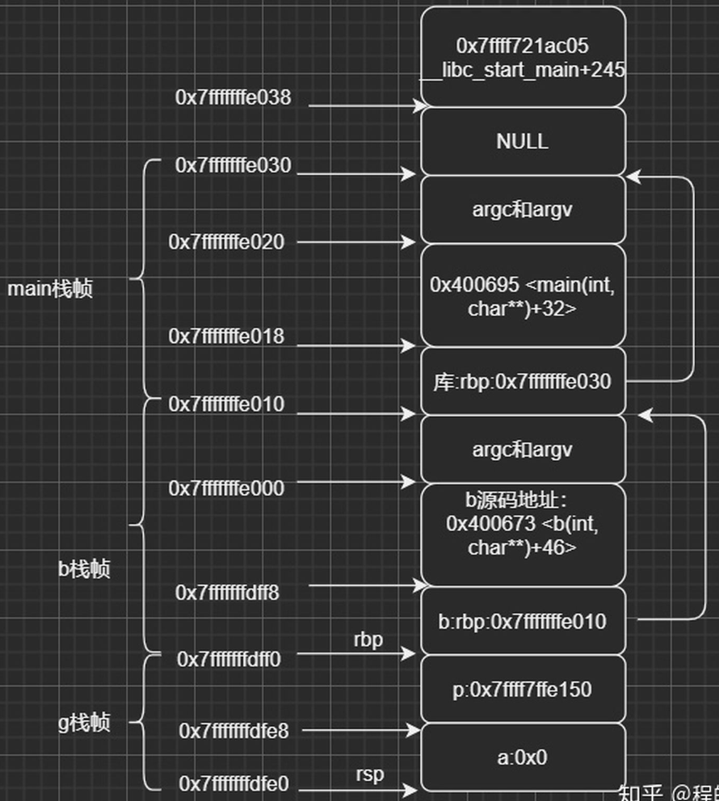

<!-- TOC -->

[1. Timer](#1-Timer)
[2. getUseFlag](#2-getUseFlag)
[3. vsprintf](#3-vsprintf)
[4. gdb](#4-gdb)

<!-- TOC -->


# 1. Timer
## simple timer
+ sleep:
    - 其中sleep精度是1秒，usleep精度是1微妙，具体代码就不写了。使用这种方法缺点比较明显，在Linux系统中，sleep类函数不能保证精度，尤其在系统负载比较大时，sleep一般都会有超时现象。
+ SIGALRM+alarm():
    - 这种方式的精度能达到1秒，其中利用了*nix系统的信号量机制，首先注册信号量SIGALRM处理函数，调用alarm()，设置定时长度，代码如下：
```cpp
#include <stdio.h>  
#include <signal.h>  
  
void timer(int sig)  
{  
        if(SIGALRM == sig)  
        {  
                printf("timer\n");  
                alarm(1);       //we contimue set the timer  
        }  
  
        return ;  
}  
  
int main()  
{  
        signal(SIGALRM, timer); //relate the signal and function  
  
        alarm(1);       //trigger the timer  
  
        getchar();  
  
        return 0;  
}  
缺点： 无法实现低于1秒的精度
```


+ RTC机制
    - 利用系统硬件提供的Real Time Clock机制，通过读取RTC硬件/dev/rtc,通过iocl()设置RTC频率：
```cpp
#include <stdio.h>  
#include <linux/rtc.h>  
#include <sys/ioctl.h>  
#include <sys/time.h>  
#include <sys/types.h>  
#include <fcntl.h>  
#include <unistd.h>  
#include <errno.h>  
#include <stdlib.h>  
  
int main(int argc, char* argv[])  
{  
        unsigned long i = 0;  
        unsigned long data = 0;  
        int retval = 0;  
        int fd = open ("/dev/rtc", O_RDONLY);  
  
        if(fd < 0)  
        {  
                perror("open");  
                exit(errno);  
        }  
  
        /*Set the freq as 4Hz*/  
        if(ioctl(fd, RTC_IRQP_SET, 1) < 0)  
        {  
                perror("ioctl(RTC_IRQP_SET)");  
                close(fd);  
                exit(errno);  
        }  
        /* Enable periodic interrupts */  
        if(ioctl(fd, RTC_PIE_ON, 0) < 0)  
        {  
                perror("ioctl(RTC_PIE_ON)");  
                close(fd);  
                exit(errno);  
        }  
  
        for(i = 0; i < 100; i++)  
        {  
                if(read(fd, &data, sizeof(unsigned long)) < 0)  
                {  
                        perror("read");  
                        close(fd);  
                        exit(errno);  
  
                }  
                printf("timer\n");  
        }  
        /* Disable periodic interrupts */  
        ioctl(fd, RTC_PIE_OFF, 0);  
        close(fd);  
  
        return 0;  
}  
```

+ slect()
    - 通过使用select()，来设置定时器；原理利用select()方法的第5个参数，第一个参数设置为0，三个文件描述符集都设置为NULL，第5个参数为时间结构体:
```cpp
#include <sys/time.h>  
#include <sys/select.h>  
#include <time.h>  
#include <stdio.h>  
  
/*seconds: the seconds; mseconds: the micro seconds*/  
void setTimer(int seconds, int mseconds)  
{  
        struct timeval temp;  
  
        temp.tv_sec = seconds;  
        temp.tv_usec = mseconds;  
  
        select(0, NULL, NULL, NULL, &temp);  
        printf("timer\n");  
  
        return ;  
}  
  
int main()  
{  
        int i;  
  
        for(i = 0 ; i < 100; i++)  
                setTimer(1, 0);  
  
        return 0;  
}  
```


## timer in project
+ 在开发高性能服务器中，定时器总是不可或缺的。 常见的定时器实现三种，分别是：
**排序链表，最小堆，时间轮。** 最小堆:在定时器数量不多时可以使用;
目前公司用的框架中的定时器是基于简单时间轮的，但是为了支持大范围的时间，每个齿轮的所维护的链表为有序链表，每次插入时先mod出spoke，再从头遍历链表以便将定时器插入到合适位置， 所以本质上还是基于有序链表的。时间复杂度并未减少。


# 2. getUseFlag
## 
```cpp

#define R_INSERT 0
#define R_UPDATE 1
#define R_CANCEL 2
#define R_USELESS 3

#define INSERT (1<<R_INSERT)
#define UPDATE (1<<R_UPDATE)
#define CANCEL (1<<R_CANCEL)

int getUse(){
    int result = 0;
    result |= R_INSERT;
    result |= R_UPDATE;
    result |= R_CANCEL;
    return result;
}

int use = getUse();
for(int i= 0; i < R_USELESS;i++){
    if(use & (1<<i)){
        //means this rule is in use;
        rules[i].push_back(thisRuleUser);
    }
}

```


# 3. vsprintf
- usage:
        ```cpp
        #include <stdio.h>
        #include <stdarg.h>

        char buffer[50];
        int vspfunc(char * format, ...){
                va_list aptr;
                int ret;

                va_start(aptr,format);
                ret = vsprintf(buffer,format,aptr);
                va_end(aptr);

                return ret;
        }

        int main(){
                int i = 5;
                float f = 27.0;
                char str[50] = "baidu.com";
                vspfunc("%d %f %s",i,f,str);
                printf("%s\n",buffer);

                return 0;
        }

        //output
        5 27.00000 baidu.com
        ```

# 4. gdb
### 堆栈信息显示问号
+ 关键的core线程，堆栈显示为问号，应该是堆栈的内存被程序破坏了。
  
   - 图中只画了一个栈帧，在gdb中可以通过frame命令查看。
   - 栈顶的地址是小地址，栈底的地址是大地址。
   - ebp和esp之间的栈帧即是一次调用。64位系统ebp已经改成rbp，esp改成rsp。

+ 栈的内容主要包括局部变量、寄存器，参数返回地址，大致排列如下:
  

   下面看一段会引起coredump的代码:
   ```cpp
   #include <stdio.h>
   #include <stdlib.h>
   
   void g() {
       int *p = 0;
       long a = 0x1234;
       printf("%p %x\n", &a, a);
       printf("%p %x\n", &p, p);
       *p = 1;
   }
  
   void b(int argc, char **argv) {
      printf("%p %p\n", &argc, &argv);
      g();
   }
  
   int main(int argc, char **argv) {
      b(argc, argv);
      return 0;
   }
   ```
   编译调试如下:
   ```cpp
   (gdb) b g
   Breakpoint 1 at 0x4005f5: file testsp.c, line 5.
   (gdb) r
   Starting program: /home/miaohq/testcode/test 
   0x7fffffffe00c 0x7fffffffe000
   Breakpoint 1, g () at testsp.c:5
   5	    int *p = 0;
   Missing separate debuginfos, use: debuginfo-install glibc-2.17-196.el7_4.2.x86_64 libgcc-4.8.5-39.el7.x86_64 libstdc++-4.8.5-39.el7.x86_64
   (gdb) p $rsp
   $14 = (void *) 0x7fffffffdfe0
   (gdb) p $rbp
   $15 = (void *) 0x7fffffffdff0
   (gdb) p &p
   $16 = (int **) 0x7fffffffdfe8
   (gdb)  x/8ag $rsp
   0x7fffffffdfe0:	0x0	0x7ffff7ffe150
   0x7fffffffdff0:	0x7fffffffe010	             0x400673 <b(int, char**)+46>
   0x7fffffffe000:	0x7fffffffe118	             0x100000000
   0x7fffffffe010:	0x7fffffffe030	             0x400695 <main(int, char**)+32>
   (gdb) p &a
   $21 = (long *) 0x7fffffffdfe0
   (gdb) p &p
   $22 = (int **) 0x7fffffffdfe8
   (gdb) x/1ag 0x7fffffffdfe8
   0x7fffffffdfe8:	0x7ffff7ffe150
   (gdb) x/1ag 0x7fffffffdff0
   0x7fffffffdff0:	0x7fffffffe010
   (gdb) x /1ag 0x7fffffffe000
   0x7fffffffe000:	0x7fffffffe118
   (gdb) x /1ag 0x7fffffffe010
   0x7fffffffe010:	0x7fffffffe030
   (gdb) x/1ag 0x7fffffffdff8
   0x7fffffffdff8:	0x400673 <b(int, char**)+46>
   (gdb)  x /1ag 0x7fffffffe018
   0x7fffffffe018:	0x400695 <main(int, char**)+32>
   ```

   这里的x/8ag表示按十六进制格式显示变量方式，显示8个8字节的内存内容。
   ```cpp
   gdb 的x命令，很少用，却很重要，格式：x /<n/f/u> n是一个正整数，需要显示的内存单元个数，一个内存单元大小由u来决定，f标识显示格式。 u包括：b:1 byte h:2 bytes w:4 bytes g:8 bytes 如：x/3uh 0x54320 表示从0x54320地址开始，以h双字节位内存单位，u是16进制的无符号整数显示。
   ```
   
   函数调用过程：
   ```cpp
   (gdb) disassemble g
   Dump of assembler code for function g():
   0x00000000004005ed <+0>:	push   %rbp
   0x00000000004005ee <+1>:	mov    %rsp,%rbp
   0x00000000004005f1 <+4>:	sub    $0x10,%rsp
   => 0x00000000004005f5 <+8>:	movq   $0x0,-0x8(%rbp)
   0x00000000004005fd <+16>:	movq   $0x1234,-0x10(%rbp)
   0x0000000000400605 <+24>:	mov    -0x10(%rbp),%rdx
   0x0000000000400609 <+28>:	lea    -0x10(%rbp),%rax
   ```
   调用开始：

   把push %rbp即把老的rbp压入到栈中，这个可以在返回的时候恢复。
   sub $0x10,%rsprsp 下移即分配栈空间为16个字节和我们预期相符和。
   分配局部变量的空间，且赋值。 再看看g函数结尾：
   ```cpp
   0x000000000040062f <+66>:	mov    $0x0,%eax
   0x0000000000400634 <+71>:	callq  0x4004d0 <printf@plt>
   0x0000000000400639 <+76>:	mov    -0x8(%rbp),%rax
   0x000000000040063d <+80>:	movl   $0x1,(%rax)
   0x0000000000400643 <+86>:	leaveq 
   0x0000000000400644 <+87>:	retq
   ```
   其中: leaveq相当于:
   movq %rbp, %rsp
   popq %rbp
   所做的动作:
   
   将%rbp的值赋值给%rsp即弹出这个函数的调用栈帧。
   弹出栈顶现在位置的值给%rbp 在g函数中这个地址为：b:rbp位置即地址：0x7fffffffe010

   

#### 如何解决堆栈问号尼
   如果因为程序的错误破坏了栈，但是有个地方数据不会破坏那就是寄存器的值，所以我们可以通过 打印rbp和rsp的值得到了最后调用栈的栈底和栈顶，但是这个这两个地址间的数据可能被破坏了，怎么办那，那就是以此地址为基准，继续对上找，就会找到其他函数的栈信息。 使用到的命令如下：
   ```cpp
   (gdb) p $rbp
   $40 = (void *) 0x7fffffffdff0
   (gdb) p $rsp
   $41 = (void *) 0x7fffffffdfe0
   (gdb) x /8ag $rbp
   0x7fffffffdff0:	0x7fffffffe010	   0x400673 <b(int, char**)+46>
   0x7fffffffe000:	0x7fffffffe118	   0x100000000
   0x7fffffffe010:	0x7fffffffe030	   0x400695 <main(int, char**)+32>
   0x7fffffffe020:	0x7fffffffe118	   0x100000000
   (gdb)
   ```
   这样我们知道了，前面的调用栈原来是通过main函数调用到b函数，接着再调用到我们core的函数，从而定位core的大概位置。