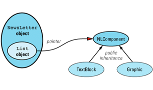
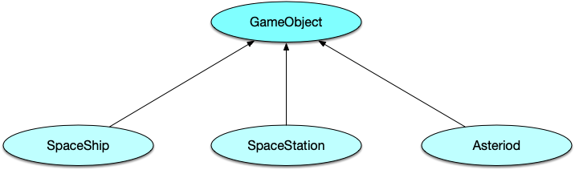

<!-- TOC -->

- [1. New](#1-new)
    - [operator new](#operator-new)
      - [new failed](#new-failed)
    - [new handler](#new-handler)
      - [什么时候该替换new和delete](#什么时候该替换new和delete)
- [2. Virtual constructor](#2-virtual-constructor)
- [3. How to virtualize according to more than one object](#3-how-to-virtualize-according-to-more-than-one-object)
    - [solution1 (virtual function RTTI):](#solution1-virtual-function-rtti)
    - [solution2 (virtual function only)](#solution2-virtual-function-only)
    - [solution3 (virtual Function Tables)](#solution3-virtual-function-tables)
    - [solution4](#solution4)
- [4. Constrain Object Number](#4-constrain-object-number)
- [5. Reduce compilation dependency](#5-reduce-compilation-dependency)
  - [the original solution comes out:](#the-original-solution-comes-out)
  - [Another way to make Handle class](#another-way-to-make-handle-class)
<!-- TOC -->


# 1. New
### operator new
(rule 4 & 8 [page:19 & 38])
+ new operator(normal new) & operator new
+ placement new 

  + new operator:
    - malloc raw memory(call operator new function)
    - set default value of Type
  + operator new:
    function ptototype:
    ```cpp
    void * operator new(size_t size);
    //[attention]:you can override this function,when you call new like this: 
    string *p = new string(),it'll call the 'operator new(size_t size)' you override, 
    ```
  + relationship between "new operator" & "operator new":
    ```
     string * p = new string("memory");
     devided into next 3 processes:
       1. void * pmemory = operator new(sizeof(string));
       2. call string::string("memory") on *pmemory;
      [attention]: only compiler can do this action,so if you want to new sth,you can only use new operator or placement new mentioned afterwards.
       3. string * ps = static_cast<string*>pmemory;
  + placement new
    - if you want to execute the 2th action above
    ```
    #include <new>
    //buffer(raw memory) has already been allocated;
    //but what if buffer is allocated by malloc()!!!
    string * constructS(void * buffer,int widgetSize){
        return new (buffer) string(widgeSize);
    }
    ```
  + deletion & deallocation(to avoid resource leak:)
    - new & delete 
    ```
    string * ps = new string();
    ...
    delete ps;
    [1.ps->~string();]
    [2.operator delete(ps);]
    ===========================

    void * buffer = operator new(50*sizeof(char));
    ...
    operator delete(buffer);
    ```
  + operator new[] & operator delete[](array new):
    ```
    string * ps = new string[10];
    ```
+ ===================================
  + don't support default constructor unless it's necessary
  ```
  class EquipmentPiece{
      public:
      EquipmentPrice(int IDNumber);
      ...
    
    int main(){
        EquipmentPiece bestP[10]; //error,no matched ctors

        typedef EquipmentPiece * PEP;
        PEP bestPiece[10]; //OK,no need to call ctors;
        PEP * bestPieces = new PEP[10]; //OK

        for(int i = 0;i < 10; ++i){
            bestPieces[i] = new EquipmentPiece(i);
        }
    }
  }

  1. remember to delete all the objects that elements in bestPieces points to;
  such as:
  for(int i = 0;i < 10; ++i){
    delete bestPieces[i];    
  } 
  otherwise it can cause memory leak(if you just call "delete [] bestPieces");
  2. you need spare space to restore pointers and objects they point to;
   ```

   + How to optimize:
    ```
    void * rawmemory = operator new [](10*sizeof(EquipmentPiece));
    EquipmentPiece * bestPieces = static_cast<EquipmentPiece *>(rawmemory);
    for(int i = 0;i < 10; ++i){
        new (&bestPieces[i]) EquipmentPiece(ID number);
    }
    ....

    //remember this
    for(int i = 9;i >=0;++i){
        bestPieces[i].~EquipmentPiece();
    }
    operator delete [](rawmemory);

    delete [] bestPieces; //undefined error
    ```
#### new failed
+ 在C++里，如果new分配内存失败，默认是抛出异常。
  ```cpp
  terminate called after throwing an instance of 'std::bad_alloc' what(): std::bad_alloc
  ```
  一般malloc/calloc等函数分配内存的时候，一定要检查返回值是不是空指针（若分配失败返回的是空指针，正常返回内存块地址）
  不过c++里面若分配失败会抛出异常，下面的语句自然不会执行。
  ```cpp
  int * p = int new[10000000000000];
  if(p == nullptr){
    return -1;
  }

  //optimum proposal
  try{
    int * p = new int[100000000000];
  } catch (const bad_alloc & e){
    return -1;
  }

  //这种方式可以抑制new抛出异常返回空指针，如此就可以正常判断p是否是空了
  //不过这种方式不具有强保证性，尽量不要使用（它只能确保operator new 不出问题），不能保证后续的构造函数不抛出异常
  int * p = new (std::nothrow) int[100000000000];
  if(p == nullptr){
    return -1;
  }
  ```
### new handler
+ 当operator new ($功能和malloc类似，只是它并不关心内存初始化的问题$) 无法满足某一内存分配需求时，它会抛出异常(以前它会返回一个null指针，某些旧编译器目前也还是那么做)。当operator new抛出异常以反映一个未获满足的内存需求之前，它会先调用一个客户指定的错误处理函数(new_handler)，客户可以通过指定这个用于处理内存不足的函数，通过调用set_new_handler函数
  ```cpp
  namespace std{
    typedef void (*new_handler)();
    //注意这里的 返回值 也是个指针，指向set_new_handler被调用前正在执行的 new_handler类型的函数（这个函数指针很快会被p替代）
    new_handler set_new_handler(new_handler p) throw();
  }

  //你可以这样使用set_new_handler函数
  void outofMem(){
    std::cerr << "Unable to satisfy request for memory\n";
    std::abort();
  }

  int main(){
    std::set_new_handler(outofMem);
    //一旦operator new无法分配足够空间，outofMem就会被不断的被调用（所以我们才会在outofMem里调用abort函数）
    int * pBigDataArray = new int[10000000000L];
  }
  ```
  当你没有调用std::set_new_handler函数指定自己定义的内存分配异常时需要调用的函数指针，operator new会在内存分配不成功时抛出异常。
+ 在C++中我们希望这种异常处理函数可以根据不同的class来作出相应不同的操作，就像这样:
  ```cpp
  class X{
    public:
    static void outofMemory();
    ....
  };

  class Y{
    public:
    static void outofMemory();
    ....
  };

  X * p1 = new X; //如果new不成功，调用X::outofMemory;
  Y * p2 = new Y; //如果new不成功，调用Y::outofMemory;
  ```
  C++并不支持class专属之new-handlers。你可以自己实现出这种行为，只需要每一个class提供自己的set_new_handler和operator new即可。
  其中set_new_handler使客户得以指定class专属的new-handler(就像std::set_new_handler允许客户指定global new_handler）
  operator new从而确保在分配class对象内存的过程中以class专属的new-handler替换global new-handler.
  例如：
  ```cpp
  //需要为Widget类型设置自己的内存分配失败的情况
  //hpp
  class NewHandlerHolder{
  public:
    explicit NewHandlerHolder(std::new_handler nh) : handler (nh){}

    ~NewHandlerHolder(){
        std::set_new_handler(handler);
    }
  private:
    std::new_handler  handler;

    NewHandlerHolder(const NewHandlerHolder &);
    NewHandlerHolder &operator=(const NewHandlerHolder&);
  };

  class Widget{
    public:
      static std::new_handler set_new_handler(std::new_handler p) throw();
      static void * operator new(std::size_t size) throw (std::bad_alloc);
    private:
      static std::new_handler currentHandler;
  };

  //cpp
  std::new_handler Widget::currentHandler = 0;

  std::new_handler Widget::set_new_handler(std::new_handler p) throw(){
    std::new_handler oldHandler = currentHandler;
    currentHandler = p;
    return oldHandler;
  }
  
  void * Widget::operator new(std::size_t size) throw (std::bad_alloc){
    NewHandlerHolder h(std::set_new_handler(currentHandler));  //set_new_handler返回的是原本的旧函数指针(null)，这里将它封装成对象，析构里会重新设置回来
    return ::operator new(size);
  }
  ```
  Widget的operator new内部会做以下事情：
  1. 调用标准set_new_handler,告知Widget的错误处理函数，这会将Widget的new-handler安装为global new-handler;
  2. 调用global operator new,执行实际的内存分配。如果分配失败，global operator new 会调用Widget的new-handler,因为那个函数才刚被安装为global new-handler。 如果global operator new最终无法分配足够内存，会抛出一个bad_alloc异常。在这种情况下Widget的operator new必须恢复原本的global new-handler,然后再传播该异常。
  3. 如果global operator new能够分配足够Widget对象所用的内存，Widget的operator new会返回一个指针，指向分配所得。
  ```cpp
  //外部使用上述Widget类
  void outofMem();

  int main(){
    Widget::set_new_handler(outofMem);
    Widget * pw1 = new Widget[1000000000];
    return 0;
  }
  ```
+ 如何达成我们想要的复用场景，设定一个base 模板class，允许derived classes继承单一的特定能力，如此一来没个derived class将获得实体互异的class data复件：
  ```cpp
  template <typename T>
  class NewHandlerSupport{
    public:
      static std::new_handler set_new_handler(std::new_hander p) throw();
      static void * operator new(std::size_t size) throw(std::bad_alloc);
      ...
    private:
      static std::new_handler currentHandler;
  };

  template <typename T>
  std::new_handler NewHandlerSupport<T>::set_new_handler(std::new_handler p) throw(){
    std::new_handler oldHandler = currentHandler;
    currentHandler = p;
    return oldHandler;
  }

  template <typename T>
  void * NewHandlerSupport<T>::operator new(std::size_t size) throw(std::bad_alloc){
    NewHandlerHolder h(std::set_new_handler(currentHandler));
    return ::operator new(size);
  }

  template <typename T>
  std::new_handler NewHandlerSupport<T>::currentHandler = 0;


  ///CRTP
  class Widget : public NewHandlerSupport<Widget>{
    ...
  }
  ```
  我们会发现上述代码中的T并未使用，我们只是希望继承自NewHandlerSupport的每一个class都拥有实体互异的NewHandlerSupport复件(更明确的说是static成员变量currentHandler)。
  上述代码最后的CRTP技术(curiously recurring template pattern)被证明是一个很有用的技术，Widget继承自一个模板化的base class，而后者又以Widget作为类型参数。
  
+ nothrow
  C++标准委员会提供了另一形式的operator new，负责供应传统的"分配失败便返回null"行为。nothrow new对异常的强制保证性并不高。
  ```cpp
  Widget * pw2 = new (std::nothrow) Widget;
  if(pw2 == 0){
    ....
  }
  ```
  nothrow new那一句代码会发生两件事:
  1. nothrow版的operator new被调用，用以分配足够内存给Widget对象。如果分配失败返回null。
  2. Widget构造函数会被调用，而Widget构造函数可以做它想做的任何事，它可能又new一些内存，而没人可以强迫它再次使用nothrow new。所以Widget构造函数可能会抛出异常。
  
  所以nothrow new只能保证operator new不抛异常，不保证像"new (std::nothrow) Widget"这样的表达式不抛出异常。

  #### 什么时候该替换new和delete
  + 理由一：用来检测运用上的错误: 如果将“new 所得内存”delete掉却不幸失败，会导致内存泄漏(memory leaks)。如果在这块new的内存身上多次delete则会导致不确定行为。 如果operator new持有一串动态分配所得地址，而operator delete将地址从中移走，就可以很容易检测出上述错误用法。
  此外各式各样的编程错误可能导致数据"overruns"（写入点在分配区块尾端之后）或"underruns"（写入点在分配区块起点之前）。 这时我们自定义一个operator news,可以多分配一些内存，比如多分配额外空间（位于客户所得区块之前或之后）放置特定的byte patterns（签名），operator delete便得以检查上述签名是否原封不动，若否就表示在分配区的某个生命时间点发生了overrun或underrun，此时operator delete可以log那个事实以及那个惹是生非的指针。
+ 可以定制内存分配，编译器缺省的new和delete只是采取的中庸之道，对于特定场景很有可能产生内存碎片。
+ 为了收集使用上的统计数据。
  ```cpp
  static const int signature = 0xDEADBEEF;
  typedef unsigned char Byte;

  //the code below has some flaws
  void operator new(std::size_t size) throw (std::bad_alloc) {
    using namespace std;
    size_t realSize = size + 2 * sizeof(int);
    void * pMem = malloc(realSize);
    if(!pMem) throw bad_alloc();

    //将signature写入内存的最前段落和最后段落
    *(static_cast<int *>(pMem)) = signature;
    *(reinterpret_cast<int*>(static_cast<Byte*>(pMem) + realSize - sizeof(int))) = signature;
    //
    return static_cast<Byte*>(pMem) + sizeof(int);
  }
  ```
  上面的operator new函数主要问题是： 1.疏忽了身为这个特殊函数所应该具备的“坚持C++规矩”的态度（所有的operator new都应该内含一个循环，反复调用某个new-handling函数）。
  2. 齐位(alignment)问题：许多计算机体系结构要求特定的类型必须放在特定的内存地址上。比如可能会要求指针的地址必须是4倍数(four-byte aligned)或doubles的地址必须是8倍数。如果没有奉行这个约束条件，可能导致运行期硬件异常。有些体系结构没这个严重，只是说如果齐位条件获得满足，便提供较佳效率（访问速度快很多）。 C++要求所有operator new返回的指针都有适当的对齐（取决于数据类型）。malloc就是在这样的要求下工作，所以令operator new返回一个得自malloc的指针是安全的，然而上述返回的是一个得自malloc且偏移一个int大小的指针。没人能够保证它的安全。

# 2. Virtual constructor
+ newsletter example



  ```cpp
class NLComponent {
public:
  // declaration of virtual copy constructor
  virtual NLComponent * clone() const = 0;
  ... 
}; 
class TextBlock: public NLComponent {
public:
  virtual TextBlock * clone() const         // virtual copy
  { return new TextBlock(*this); }          // constructor
  ... 
}; 
class Graphic: public NLComponent {
public:
  virtual Graphic * clone() const            // virtual copy
  { return new Graphic(*this); }             // constructor
  ... 
};

//注意上述代码的实现利用了最近才被采纳的较宽松的虚拟函数返回值类型规则。被派生类重定义的虚拟函数不用必须与基类的虚拟函数具有一样的返回类型。
//如果函数的返回类型是一个指向基类的指针（或一个引用），那么派生类的函数可以返回一个指向基类的派生类的指针（或引用）。这不是C++的类型检查上的漏洞，它使得有可能声明象虚拟构造函数这样的函数。
//这就是为什么TextBlock的clone函数能够返回TextBlock*和Graphic的clone能够返回Graphic*的原因，即使NLComponent的clone返回值类型为NLComponent*。


//在NLComponent中的虚拟拷贝构造函数能让实现NewLetter的(正常的)拷贝构造函数变得很容易：
class NewsLetter {
public:
  NewsLetter(const NewsLetter& rhs);
  ... 
private:
  list<NLComponent*> components;
}; 
NewsLetter::NewsLetter(const NewsLetter& rhs)
{
  // 遍历整个rhs链表，使用每个元素的虚拟拷贝构造函数
  // 把元素拷贝进这个对象的component链表。
  // 有关下面代码如何运行的详细情况，请参见条款M35.
  for (list<NLComponent*>::const_iterator it =
          rhs.components.begin();
       it != rhs.components.end();
       ++it) { 
  // "it" 指向rhs.components的当前元素，调用元素的clone函数，
  // 得到该元素的一个拷贝，并把该拷贝放到
  // 这个对象的component链表的尾端。
    components.push_back((*it)->clone());
  }
}

//我们在这里需要一个虚拟构造函数，因为链表中包含指向NLComponent对象的指针;
//但是我们知道其实每一个指针不是指向TextBlock对象就是指向Graphic对象。
//无论它指向谁，我们都想进行正确的拷贝操作，虚拟构造函数能够为我们做到这点。


//然而，既然一个函数能够构造出不同类型的新对象是可以理解的；
//那么同样也存在这样的非成员函数，可以根据参数的不同动态类型而其行为特性也不同。
class NLComponent {
public:
  // 对输出操作符的不寻常的声明
  virtual ostream& operator<<(ostream& str) const = 0;
  ...
}; 
class TextBlock: public NLComponent {
public:
  // 虚拟输出操作符(同样不寻常)
  virtual ostream& operator<<(ostream& str) const;
}; 
class Graphic: public NLComponent {
public:
  // 虚拟输出操作符 (让就不寻常)
  virtual ostream& operator<<(ostream& str) const;
};
TextBlock t;
Graphic g; 
... 
t << cout;                                  // 通过virtual operator<<
                                            //把t打印到cout中。
                                            // 不寻常的语法
g << cout;                                  //通过virtual operator<<
                                            //把g打印到cout中。
                                            //不寻常的语法

//为了能够回到正常的语法上来，我们必须把operator<<移出TextBlock 和 Graphic类；
//但是如果我们这样做，就不能再把它声明为虚拟了。
我们想要的是一个称为operator<<的非成员函数，其具有象print虚拟函数的行为特性。
有关我们想要什么的描述实际上已经很接近如何得到它的描述。我们定义operator<< 和print函数，让前者调用后者！


class NLComponent {
public:
  virtual ostream& print(ostream& s) const = 0;
  ... 
}; 

class TextBlock: public NLComponent {
public:
  virtual ostream& print(ostream& s) const{
    s<<"print TextBlock"<<std::endl;
    return s;
    ...
  }
}; 

class Graphic: public NLComponent {
public:
  virtual ostream& print(ostream& s) const;
  ... 
}; 

//外部函数调用print
inline ostream& operator<<(ostream& s, const NLComponent& c)
{
  return c.print(s);
}
现在你知道如何根据它们的一个参数让非成员函数虚拟化，你可能想知道是否可能让它们根据一个以上的参数虚拟化呢？看下面第三点。
  ```


# 3. How to virtualize according to more than one object
+ question:
  假如你决定编写一个video game,游戏的背景是发生在太空，有宇宙飞船、太空站和小行星。
  在你构造的世界中的宇宙飞船、太空站和小行星，它们可能会互相碰撞。假设其规则是：
  - 如果飞船和空间站以低速接触，飞船将泊入空间站。否则，它们将有正比于相对速度的损坏。
  - 如果飞船与飞船，或空间站与空间站相互碰撞，参与者均有正比于相对速度的损坏。
  - 如果小行星与飞船或空间站碰撞，小行星毁灭。如果是小行星体积较大，飞船或空间站也毁坏。
  -	如果两个小行星碰撞，将碎裂为更小的小行星，并向各个方向溅射。
这好象是个无聊的游戏，但用作我们的例子已经足够了，考虑一下怎么组织C++代码以处理物体间的碰撞。



现在，假设你开始进入程序内部，写代码来检测和处理物体间的碰撞。你会提出这样一个函数:
  ```cpp
void checkForCollision(GameObject& object1,
                       GameObject& object2)
{
  if (theyJustCollided(object1, object2)) {
    processCollision(object1, object2);
  }
  else {
    ...
  }
}

  ```
而此时你并不知道object1和object2的真实类型；
如果碰撞的处理过程只取决于object1的动态类型，你可以将processCollision()设为虚函数，并调用object1.processColliion(object2)。
如果只取决于object2的动态类型，也可以同样处理。
但现在，取决于两个对象的动态类型。$虚函数体系只能作用在一个对象身上$，它不足以解决问题。

你需要的是一种作用在多个对象上的虚函数。C++没有提供这样的函数。可是，你必须要实现上面的要求。现在怎么办呢？

### solution1 (virtual function RTTI):
+ 虚函数实现了一个单一调度，这只是我们所需要的一半；
编译器为我们实现虚函数，所以我们在GameObject中申明一个虚函数collide。
这个函数被派生类以通常的形式重载：

  ```cpp
  class GameObject {
  public:
  virtual void collide(GameObject& otherObject) = 0;
  ...
  };

  class SpaceShip: public GameObject {
  public:
  virtual void collide(GameObject& otherObject);
  ...
  };
  //SpaceStation 和 Asteroid类似


  // if we collide with an object of unknown type, we
  // throw an exception of this type:
  class CollisionWithUnknownObject {
  public:
  CollisionWithUnknownObject(GameObject& whatWeHit);
  ...
  };

  void SpaceShip::collide(GameObject& otherObject)
  {
    const type_info& objectType = typeid(otherObject);
    if (objectType == typeid(SpaceShip)) {
      SpaceShip& ss = static_cast<SpaceShip&>(otherObject);
      process a SpaceShip-SpaceShip collision;
    }
    else if (objectType == typeid(SpaceStation)) {
      SpaceStation& ss =
        static_cast<SpaceStation&>(otherObject);
      process a SpaceShip-SpaceStation collision;
    }
    else if (objectType == typeid(Asteroid)) {
     Asteroid& a = static_cast<Asteroid&>(otherObject)  ;
      process a SpaceShip-Asteroid collision;
    }
    else {
      throw CollisionWithUnknownObject(otherObject);
    }
  }

  注意，我们需要检测的只是一个对象的类型。另一个是*this，它的类型由虚函数体系判断。
  我们现在处于SpaceShip的成员函数中，所以*this肯定是一个SpaceShip对象，因此我们只需找出otherObject的类型
  ```
  
+ 该方法缺点是放弃了封装，完全c的风格，不好维护，如果增加一个新的类时，我们必须更新每一个基于RTTI的if...then...else链以处理这个新的类型。

### solution2 (virtual function only)
+ 这个方法和RTTI方法有这同样的基本构架。collide函数被申明为虚，并被所有派生类重定义，此外，它还被每个类重载，每个重载处理一个派生类型

  ```cpp
  class SpaceShip;                        // forward declarations
  class SpaceStation;
  class Asteroid;
  class GameObject {
  public:
    virtual void collide(GameObject&      otherObject) = 0;
    virtual void collide(SpaceShip&       otherObject) = 0;
    virtual void collide(SpaceStation&    otherObject) = 0;
    virtual void collide(Asteroid&        otherobject) = 0;
  ...
  };

  class SpaceShip: public GameObject {
  public:
    virtual void collide(GameObject&       otherObject);
    virtual void collide(SpaceShip&        otherObject);
    virtual void collide(SpaceStation&     otherObject);
    virtual void collide(Asteroid&         otherobject);
    ...
  };

  基本原理就是用两个单一调度实现二重调度,也就是说有两个单独的虚函数调用：
  第一次决定第一个对象的动态类型，第二次决定第二个对象动态类型。

  void SpaceShip::collide(GameObject& otherObject)
  {
    //现在*this的静态类型是SpaceShip，调用的是 otherObject的 collide(SpaceShip & ot)
    otherObject.collide(*this);
  }
  void SpaceShip::collide(SpaceShip& otherObject)
  {
    process a SpaceShip-SpaceShip collision;
  }
  void SpaceShip::collide(SpaceStation& otherObject)
  {
    process a SpaceShip-SpaceStation collision;
  }
  void SpaceShip::collide(Asteroid& otherObject)
  {
    process a SpaceShip-Asteroid collision;
  }

  ```
  + 此方法的缺点:每个类都必须知道他的同胞类，当增加新类时，所有的代码都必须更新。例:如果你要增加一个Satellite类，必须为每个现存类增加一个collide方法:
  ```cpp
  void SpaceShip::collide(Satellite& otherObject)
  {
    process a SpaceShip-Satellite collision;
  }
  ```

### solution3 (virtual Function Tables)
+ 基本思想是通过维系一个关系数组（map），通过这种映射关系找到对应的函数指针，从而执行相应的操作；
  ```cpp
  class GameObject{
  public:
    virtual void collide(GameObject & otherObject) = 0;
  };

  class SpaceShip : public GameObject{

  public:
    typedef void (SpaceShip::*HitFunctionPtr)(GameObject &);
    typedef std::map<std::string,HitFunctionPtr> HitMap;
    //
    static HitFunctionPtr lookup(const GameObject & whatWeHit);

    virtual void collide(GameObject & otherObject);
    //
    virtual void hitSpaceShip(SpaceShip & otherObject);
    virtual void hitSpaceStation(SpaceStation & otherObject);
    virtual void hitAsteroid(Asteroid & otherObject);

  private:
    static HitMap initializeCollisionMap();
  };

  //
  SpaceShip::HitMap * SpaceShip::initializeCollisionMap(){
    HitMap * phm = new HitMap;
    //bad idea, hitSpaceShip is not the second type of HitMap
    //the cast tells compiler that hitSpaceShip,hitSpaceStation,hitAsteroid expect 
    //the parameter 'GameObject',but hitSpaceShip expect SpaceShip
    (*phm)["SpaceShip"] = reinterpret_cast<HitFunctionPtr>(&hitSpaceShip);
    (*phm)["SpaceStation"] = reinterpret_cast<HitFunctionPtr>(&hitSpaceStation);
    (*phm)["Asteroid"] = reinterpret_cast<HitFunctionPtr>(&hitAsteroid);
    return phm;
  }


  void SpaceShip::HitFunctionPtr SpaceShip::lookup(const GameObject & whatWeHit){
    //
    //static HitMap collisionMap = initializeCollisionMap();
    static auto_ptr<HitMap> collisionMap(initializeCollisionMap());

    auto mapEntry = collisionMap.find(typeid(whatweHit).name());
    if(mapEntry == collisionMap.end())
      return 0;
    return (*mapEntry).second;
  }

  void SpaceShip::collide(GameObject & otherObject){
    HitFunctionPtr hfp = lookup(otherObject);
    if(hfp){
      (this->*hfp)(otherObject);
    }else{
      throw CollisionWithUnknownObject(otherObject);
    }
  }

  void SpaceShip::hitSpaceShip(SpaceShip& otherObject)
  {
    process a SpaceShip-SpaceShip collision;
  }
  void SpaceShip::hitSpaceStation(SpaceStation& otherObject)
  {
    process a SpaceShip-SpaceStation collision;
  }
  void SpaceShip::hitAsteroid(Asteroid& otherObject)
  {
    process a SpaceShip-Asteroid collision;
  }
  ```
    + the interpret_cast in function 'initializeCollisionMap'  may guide you to the wrong address when subclass has multibase classes;
    ```cpp
    void SpaceShip::hitSpaceShip(GameObject& spaceObject)
    {
        SpaceShip & otherObject = dynamic_cast<SpaceShip &>(spaceObject);
        process a SpaceShip-SpaceShip collision;
    }
    void SpaceShip::hitSpaceStation(GameObject& spaceStationObject)
    {
        SpaceStation & otherObject = dynamic_cast<SpaceStation &>(spaceStationObject);
        process apaceShip-SpaceStation collision;
    }
    void SpaceShip::hitAsteroid(GameObject& asteroidObject)
    {
        Asteroid & otherObject = dynamic_cast<Asteroid &>(asteroidObject);
        process a SpaceShip-Asteroid collision;
    }
    //if GameObject and SpaceShip is not related(SpaceShip inherit  GameObject, or GameObject inherit SpaceShip)
    //it'll throw a exception(bad cast)
    //you'd better use 'dynamic_cast<SpaceShip *>(spaceObject)' 
    ```
### solution4


# 4. Constrain Object Number
+ constrain object to 0 or 1
  - providing that have only one printer in your office,you wish that the number of the printer is 1;
  ```cpp
  //solution 1: let constructor be private
  class PrintJob;
  namspace PrintingStuff{
    class Printer{
    public:
      void submitJob(const PrintJob & job);
      void reset();
      .......
      //friend function
      friend Printer & thePrinter();
    private:
      Printer();
      Printer(const Printer & rhs);
      .......
  };

  Printer & thePrinter(){
    static Printer p;
    return p;
    }
  }
  
  using PrintingStuff::thePrinter;
  int main(){
    thePrinter().reset();
    ......
    return 0;
  }
  ```
  - the global function "thePrinter" acts like a global variable while global variable is a clumsy design,so you can put the function into class:
  ```cpp
  class PrintJob;
  class Printer{
    public:
      static Printer & thePrinter();
      .......
    private:
      Printer();
      Printer(const Printer & rhs);
      .......
  };

  Printer & Printer::thePrinter(){
    static Printer p;
    return p;
  }

  int main(){
    Printer::thePrinter().reset();
    ......
    return 0;
  }
  ```
  question 1 : why using function static object instead of class static object;
  - function static object is initialized when it's called at first time,if the funtion isn't called,the static object is not initialized;
  - class static object is always initialized whether it's used or not, and it's uncertain when it's been initialized in different compile units;

  question 2 : since 'thePrinter' is a simple function,why not using 'inline' keyword just like this:
  ```cpp
  inline Printer & thePrinter(){
    static Printer p;
    return p;
  }
  ```
  - inline means internal linkage,that means object code will copy more than one code including the function static object,so you'd better not add inline keyword to non-member funcions when it contains static object (it's been solved since 1966 July,fixed inline internal linkage to external linkage)

+ constrain object to n:
  - you may write code like this:
  ```cpp
  class Printer{
  public:
    class TooManyObjects{}; //exception class
    Printer(){
      if(numObjects >= 1){
        throw TooManyObjects();
      }
      ....
      ++numObjects;
    }

    ~Printer(){
      --numObjects;
    }
    ......
  private:
    static size_t numObjects;

    Printer(const Printer & rhs);
  };
  ``` 
  - you may encounter the problem like this:
  ```cpp
  class ColorPrinter : public Printer{

  };

  //
  class CPFMachine{
  private:
    Printer p;
    FaxMachine f;
    CopyMachine c;
    ...
  };

  int main(){
    CPFMachine m1;  //OK
    CPFMachine m2;  //tooManyObjects exception

    Printer p;
    CorlorPrinter cp;  //tooManyObjects exception,since when cp is constructed, it constructs another one Printer object which causes numObject > 1
  }
  ```
  - final version of Printer(numObject = 10 at most)
  ```cpp
  class Printer{
  public:
    class TooManyObjects{};

    //pseudo-constructors
    static Printer * makePrinter();
    static Printer * makePrinter(const Printer & rhs);
    ...
  private:
    static size_t numObjects;
    static const size_t maxObject = 10;
  private:
    Printer();
    Printer(const Printer & rhs);
  };

  size_t Printer::numObjects = 0;
  const size_t Printer::maxObjects;

  Printer::Printer(){
    if(numObjects >= maxObjects){
      throw TooManyObjects();
    }
    ++numObjects;
    ...
  }

  Printer::Printer(const Printer & rhs){
    if(numObjects >= maxObjects){
      throw TooManyObjects();
    }
    ...
  }

  Printer * Printer::makePrinter(){
    return new Printer;
  }
  Printer * Printer::makePrinter(const Printer &rhs){
    return new Printer(rhs);
  }
  ```

  Now we're able to successfully constrain obejct number to n,but what if there's another type who needs to be counted,should we write these identical codes again?

+ inherit a template class which is used to count
  ```cpp
  template <class BeingCounted>
  class Counted{
  public:
    class TooManyObjects{}
    static int objectCount() {return numObjects;}
  protected:
    Counted();
    Counted(const Counted & rhs);
    ~Counted() {--numObjects;}
  private:
    static int numObjects;
    static const size_t maxObjects;
    void init();
  };

  template <class BeingCounted>
  void Counted<BeingCounted>::init(){
    if(numObjects > maxObjects)
      throw TooManyObjects;
    ++numObjects;
  }

  template <class BeingCounted>
  Counted<BeingCounted>::Counted(){
    init();
  }

  template <class BeingCounted>
  Counted<BeingCounted>::Counted(const Counted<BeingCounted> &){
    init();
  }

  //we define numObjects here in some cpp file;and it's automatically initialized '0';
  //but we can't define maxObjects cause we have no idea which value should be set to it;
  template<class BeingCounted>
  int Counted<BeingCounted>::numObjects;


  //use
  class Printer : private Counted<Printer>{
  public:
    //pseudo-constructors
    static Printer * makePrinter();
    static Printer * makePrinter(const Printer & rhs);
    ~Printer();

    void submitJob(const PrintJob & rhs);
    void reset();
    void performSelfTest();
    ...
    //use 'using declaration' to make these 2 functions public which is private after the inheritation
    using Counted<Printer>::objectCount;
    using Counted<Printer>::TooManyObjects;
  private:
    Printer();
    Printer(const Printer & rhs);
  }
  ```
  - the maxObjects should be set when used in user's cpp file,if users don't define it,they'll encounter link error;
  ```cpp
  //user's cpp
  const size_t Counted<Printer>::maxObjects = 10;
  ```

# 5. Reduce compilation dependency
+ Providing that you modify the private part      (implemention of some private function) of some class, then you compile the code that used the class,you'll find that the compiler'll recompile all the code.
  such as the instance below:
  ```cpp
  //person.h
  #include <string>
  #include "date.h"
  #include "address.h"

  class Person{
    public:
      Person(const std::string & name,const Date & birthday,const Address & addr);
      std::string name() const;
      std::string birthDate() const;
      std::string address() const;
  };
  ```
  once one of the head files among "date.h" and "address.h" is modified (or the files the two head files quote), every file that includes "person.h" will recompile, the cascading compilation dependencies do damgaes to many projects.

+ maybe you have some good points such as putting the front declaration before the 'Person' class definition:
  ```cpp
  //person.h
  class Date;
  class Address;
  class Person{
    public:
      Person(const std::string & name,const Date & birthday,const Address & addr);
      std::string name() const;
      std::string birthDate() const;
      std::string address() const;
  };
  ```
  you can use the 'person.h' like this:
  ```cpp
  #include "person.h"
  int main(){
    int x;
    Person p(params ....); //error
  }
  ```
  so in which way can compiler find the size of "p"?
  of course you can code like this:
  ```cpp
  int main(){
    Person *p; //pointer type which is  4b
  }
  ```

## the original solution comes out:
  ```cpp
  //person.h
  class PersonImpl;
  class Date;
  class Address;

  class Person{
    public:
      Person(const std::string & name,const Date & birthday,const Address & addr);
      std::string name() const;
      std::string birthDate() const;
      std::string address() const;
      ...
    private:
      std::tr1::shared_ptr<PersionImpl> pImpl;  
  };
  ```
  ```cpp
  #include "person.h"
  #include "personImpl.h"

  Person::Person(const std::string & name,const Date& birthday,const Address &address)
  :pImp(new PersonImp(name,birthday,addr)){
  }

  std::string Person::name() const{
    return pImpl->name();
  }
  ```
  this design pattern is called **"pimpl idiom  (pointer to implemention)"**. In this way, we can divide the user of "person.h" from the implementions of "Date","Address" and "Person";
  And the class like "Person" who uses the 'pimpl idiom' is called **"Handle classes"**
+ it generates two rules:
  - use 'object reference' or 'object pointers' as much as possible rather than use object which need to know the size of the type;
  - use 'class declaration' instead of using 'class definition';
  - offer different head files of 'class declaration' and 'class defintion',sush as:
  ```cpp
  //head files for declaration
  //datefwd.h
  class Date;
  class Address;
  class Name;
  ```
  ```cpp
  //head files for declaration
  //datedf.h
  class Date{
    public:
      Date(){....}
      void name(){std::cout<<"date";}
    private:
      int d;
  };
  class Address{
    public:
      Address(){....}
      void name(){std::cout<<"address";}
    private:
      int a;
  };
  ```
  if a user just wants to use the declaration of Date, he needs to include "datefwd.h",however if he wants to use the definition of 'Date',he must include "datedf.h";
  ```cpp
  #include "datefwd.h"

  class Time{
    public:
      Time(const Date & date){}
      Date getDate(){}
  };
  ```
  ```cpp
  #include "datedf.h"

  class Time{
    public:
      Time(const Date & date){
        date.name();
      }
      Date getDateSize(){
        std::cout<<sizeof(Date)<<std::endl;
      }
  };
  ```

## Another way to make Handle class
+ make "Person" class be the abstract base class:
  ```cpp
  //"person.h"
  class Person{
    public:
      static std::tr1::shared_ptr<Person> create(const std::string & name,const Date & birthday,const Address & addr);
      std::string name() const = 0;
      std::string birthDate() const = 0;
      std::string address() const = 0;
      ...
    private:
      std::tr1::shared_ptr<PersionImpl> pImpl;  
  };
  ```
  ```cpp
  //"personImpl.h"
  #include "person.h"

  class RealPerson : public Person {
    public:
      RealPerson(const std::string & name,const Date & birthday, const Address & addr)
      : theName(name),theBirthDate(birthday),theAddress(addr){
      }
      virtual ~RealPerson(){}
      std::string name() const;
      std::string birthDate() const;
      std::string address() const;
    private:
      std::string theName;
      Date theBirthDate;
      Address theAddress;
  };

  std::tr1::shared_ptr<Person> Person::create(const std::string & name,const Date & birthday,const Address & addr){
    return std::tr1::shared_ptr<Person>(new RealPerson(name,birthday,addr));
  }
  ```

  normally we can use it like this:
  ```cpp
  #include "person.h"

  int main(){
    std::string name;
    Date dateofBirth;
    Address address;
    std::tr1::shared_ptr<Person> pp(Person::create(name,dateofBirth,address));
    //std::tr1::shared_ptr<Person> pp = std::make_shared<Person>(Person::create(name,dateofBirth,address));

    std::cout<<pp->name()<<"was born on "<<pp->birthDate()<<" and now lives at "<<pp->address();
  }
  ```