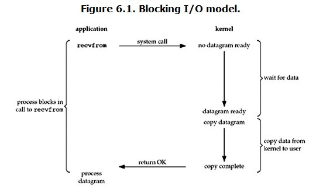
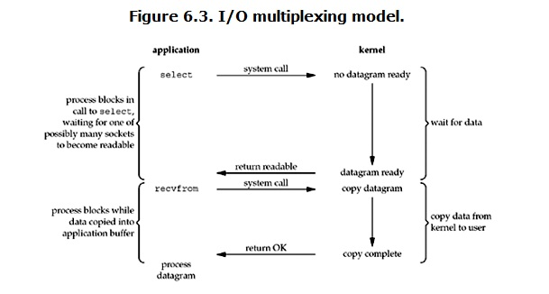

<!-- TOC -->
- [1. SystemIO](#1-systemio)
    - [I/O模式](#io模式)
      - [阻塞IO](#阻塞io)
      - [非阻塞IO](#非阻塞io)
      - [I/O多路复用(IO multiplexing)](#io多路复用io-multiplexing)
      - [异步I/O（asynchronous IO）](#异步ioasynchronous-io)
    - [block & non-block, synchronize & nonsynchronize](#block--non-block-synchronize--nonsynchronize)
      - [block & non-block](#block--non-block)
      - [synchronize & nonsynchronize](#synchronize--nonsynchronize)
    - [select & poll & epoll](#select--poll--epoll)
      - [epoll](#epoll)
- [2. BoostAsio](#2-boostasio)
  - [Detail](#detail)
  - [Async](#async)
  - [post() vs dispatch()](#post-vs-dispatch)
  - [run() vs poll()](#run-vs-poll)
  - [stop()](#stop)
  - [strand()](#strand)
- [3. Timer Vector](#3-timer-vector)


<!-- TOC -->


# 1. SystemIO
+ 现在操作系统都采用虚拟存储器，对于32位操作系统而言，它的寻址空间(虚拟存储空间)为4G($2^{32}$ = 4 * $2^{10}$ * $2^{10}$ * $2^{10}$ B)。操作系统核心是内核，独立于普通的应用程序，可以访问受保护的内存空间，也有访问底层硬件设备的所有权限。为了保证用户进程不能直接操作内核，操作系统将虚拟空间划分为两部分： 内核空间，用户空间。 对于linux系统而言，将最高的1G字节(虚拟地址0xC0000000到oxFFFFFFFF)供内核使用，称为内核空间。将较低的3G字节(虚拟地址0x00000000到0xBFFFFFFF)供各进程使用，称为用户空间。
+ 进程切换： 为了控制进程执行，内核必须有能力挂起正在CPU上运行的进程，并恢复以前挂起的某个进程的执行。 从一个进程的运行转到另一个进程上运行，过程中经过下面这些变化：
  - 保存处理机上下文，包括程序计数器和其他寄存器；
  - 更新PCB信息；
  - 把进程的PCB移入相应的队列，如就绪、在某事件阻塞等队列；
  - 选择另一个进程执行，并更新其PCB；
  - 更新内存管理的数据结构；
  - 恢复处理机上下文；
+ 进程的阻塞：正在执行的进程，由于期待的某些事件未发生，如请求系统资源失败、等待某种操作的完成、新数据尚未到达或无新工作做等，则由系统自动执行阻塞原语(Block),使自己由运行状态变为阻塞状态。可见进程的阻塞是进程自身的一种主动行为，也因此只有处于运行态的进程（获得CPU资源），才可能将其转为阻塞状态。
+ 缓存I/O（标准I/O）：大多数文件系统的默认I/O操作都是缓存I/O。在linux的缓存I/O机制中，操作系统会将I/O的数据缓存在文件系统的页缓存(page cache)中，即数据先被拷贝到操作系统内核的缓冲区中，然后才会从操作系统内核的缓冲区拷贝到应用程序的地址空间。 这就产生一些缺点：数据在传输过程中需要在应用程序地址空间和内核进行多次数据拷贝操作，这些动作带来的CPU以及内存开销是非常大的。

### I/O模式
+ 对于一次I/O访问(read为例)，数据会先被拷贝到操作系统内核的缓冲区，然后会从操作系统内核的缓冲区拷贝到应用程序的地址空间。所以read会经历两个阶段：
  - 等待数据准备(waiting for the data to be ready)
  - 将数据从内核拷贝到进程中(copying the data from the kernel to the process)
+ 根据这两个阶段，linux系统产生了下面五种网络模式的方案：
  - 阻塞I/O(blocking IO)
  - 非阻塞I/O(nonblocking IO)
  - I/O多路复用(IO multiplexing)
  - 信号驱动I/O(signal driven IO) //不常用，这里不赘述
  - 异步I/O(asynchronous IO)

#### 阻塞IO

+ 当用户进程调用了recvfrom这个系统调用，kernel就开始了IO的第一个阶段：准备数据（可能一开始很多数据还没有完全到达，比如还没收到一个完整的UDP包）。这个过程也需要等待，即数据被拷贝到操作系统内核缓冲区是需要一个过程的。此时用户进程这边会被阻塞。 第二个阶段：kernel等到数据准备好了，它会将数据从kernel中拷贝到用户内存，然后kernel返回结果，用户进程才接触block状态，重新运行起来。 特点： IO执行的两个阶段都被block了。
#### 非阻塞IO

+ 当用户进程发出read操作时，如果kernel中的数据还没有准备好，那么它并不会block用户进程，而是立刻返回一个error。用户进程马上得到这个结果，然后他会再次发送read操作，一旦kernel中的数据准备好了，并且又再次收到了用户进程的systemcall，那么它马上就将数据拷贝到用户内存，然后返回。
#### I/O多路复用(IO multiplexing)

+ 多路复用就是我们常见的select,poll,epoll,好处在于单个process就可以同时处理多个网络连接的IO，当某个socket有数据到达了，就通知用户进程。 **当用户进程调用了select，那么整个进程会被block**，同时kernel会监视所有的select负责的socket，当任何一个socket中的数据准备好了，select就会返回，这个时候用户进程再调用read操作，将数据从kernel拷贝到用户进程。这里需要使用两个systemcall(select和recvfrom)，而blockingIO只调用了一个systemcall（recvfrom），select的优势在于他可以同时处理多个connection；
#### 异步I/O（asynchronous IO）

+ 用户进程发起read操作之后，立刻就可以去做其他的事情，kernel收到一个异步的read请求后，首先会立刻返回，所以不会对用户进程产生任何block，然后kernel会等待数据准备完成，然后将数据拷贝到用户内存，完成之后kernel会给用户进程发送一个signal，告诉它read操作完成了。

### block & non-block, synchronize & nonsynchronize
#### block & non-block
+ 阻塞和非阻塞关注的是程序在等待调用结果（消息，返回值）时的状态。
  - 阻塞调用是指调用结果返回之前，当前线程会被挂起。调用线程只有在得到结果之后才会返回。
  - 非阻塞调用指在不能立刻得到结果之前，该调用不会阻塞当前线程。
#### synchronize & nonsynchronize
+ 同步与异步关注的是消息通信机制(synchronous communication/asynchronous communication)。
  - 同步: 发出一个调用时，在没有得到结果之前，该调用就不返回。但是一旦调用返回，就得到返回值。其实就是由调用者主动等待这个调用的结果。
  - 异步: 调用发出之后，这个调用就直接返回了，所以没有返回结果。当一个异步过程调用发出后，调用者不会立刻得到结果。而是在调用发出后，被调用者通过状态、通知来通知调用者，或通过回调函数处理这个调用。

### select & poll & epoll

#### epoll
+ 对于非阻塞忙轮询，会占用CPU时间，如果线程睡眠了，就掉出了系统的调度队列，暂时不会去瓜分CPU宝贵的时间片了。为了解释阻塞是如何进行的，我们来讨论缓冲区，以及内核缓冲区，最终把I/O事件解释清楚。缓冲区的引入是为了减少频繁的I/O操作引起频繁的系统调用，当你操作一个流时，更多的是以缓冲区为单位进行操作，这是相对于用户空间而言。对于内核来说，也需要缓冲区。
  - 假设有一个管道，进程A为管道的写入方，B为管道的读出方。
  【缓冲区非空】：假设一开始内核缓冲区是空的，B作为读出方，被阻塞着。然后A开始往管道写入数据，这时候内核缓冲区由空的状态变到非空状态，内核会产生一个事件告诉B该醒来了，这个事件我们可以称它为“缓冲区非空”。
  【缓冲区满】：在 “缓冲区非空”事件通知B后，B却还没有读出数据；且内核许诺了不能把写入管道中的数据丢掉，这个时候A写入的数据会滞留在内核缓冲区中，如果内核缓冲区满了，B仍未开始读数据，最终内核缓冲区会被填满，这个时候会产生I/O事件，告诉进程A，你该等等**阻塞**了，这个事件可以称它为“缓冲区满”。
  【缓冲区非满】：后来B终于开始读取数据了，于是内核的缓冲区空了出来，这时候内核会告诉A，内核缓冲区有空位了，A可以从阻塞状态被唤醒了，继续往缓冲区写数据，这个事件称”缓冲区非满“。
  【缓冲区空】：假如事件已经通知了A，但是A并没有数据要写入缓冲区，而B继续读出数据直到缓冲区空了，这个时候内核告诉B，你需要**阻塞**了，这个事件称”缓冲区空“。
  - 上述四个事件都是说的内核缓冲区。这四个I/O事件是进行阻塞同步的根本。
+ 为了避免CPU空转，可以引进一个代理（一开始有一位叫做select的代理，后来又有一个叫做poll的代理，两者本质是一样的）。这个代理可以同时观察许多流的I/O事件，在空闲的时候会把当前线程阻塞掉，当有一个或多个流有I/O事件时，就从阻塞状态中醒来，于是我们的程序就会轮询一边所有的流：
  ```cpp
  while (true){
      select(streams[]);  //没有I/O事件的时候就会阻塞在这里
      for i in streams[] {
          if i hasdata
            read until unavailable
      }
  }
  ```
  不过有个问题，我们从select那里仅仅知道了有I/O事件发生，但却并不知道是哪几个流(可能有一个，多个，甚至全部)，我们只能无差别轮询所有的流，找出能读出数据或者写入数据的流，进而对他们进行操作。

  epoll这个时候就可以登场了，不同于忙轮询和无差别轮询，epoll只会把哪个流发生了怎样的I/O事件通知到我们。此时我们对这些流的操作都是有意义的（复杂度降低到了O(k),k为产生I/O事件的流的个数，也可以认为是O(1)）。
  epoll相关操作:
  - epoll_create 创建一个epoll对象，epollfd = epoll_create();
  - epoll_ctl(epoll_add/epoll_del的合体)，往epoll对象中增加/删除某一流的某一个事件
  比如：
  epoll_ctl(epollfd,EPOLL_CTL_ADD,socket,EPOLLIN); //缓冲区内有数据的时候（【缓冲区非空】）epoll_wait返回
  epoll_ctl(epollfd,EPOLL_CTL_DEL,socket,EPOLLOUT); //缓冲区可写入时（【缓冲区非满】）epoll_wait返回
  - epoll_wait(epollfd,....) //等待直到注册的事件发生
  **epoll只关心缓冲区非满和缓冲区非空的事件**
  pseudo code
  ```cpp
  while(true){
      active_stream[] = epoll_wait(epollfd);
      for i in active_stream[] {
          read or write until unavailable
      }
  }
  ```

# 2. BoostAsio
## Detail
+ No Deprecated:
  - 在包含Asio头文件之前，定义宏BOOST_ASIO_NO_DEPRECATED,这样在编译的时候，Asio就会删除那些已经过时的接口。（例如在boost1.66中 io_service 已经改名为io_context），如果不定义上面的宏，还是可以使用io_serivce。
  ```cpp
  #define BOOST_ASIO_NO_DEPRECATED
  
  #include "boost/asio/io_context.hpp"
  ....
  ```
+ TCP Server的acceptor一般是这样构造的:
```cpp
/* function type */
basic_socket_acceptor(boost::asio::io_context& io_context,
      const endpoint_type& endpoint, bool reuse_addr = true)

//以上这段代码相当于下面这一块：
basic_socket_acceptor<Protocol> acceptor(io_context);
acceptor.open(endpoint.protocol());
if (reuse_addr)
  acceptor.set_option(socket_base::reuse_address(true));
acceptor.bind(endpoint);
acceptor.listen(listen_backlog);

/*用法*/
//no need to point address
tcp::acceptor(io_context,tcp::endpoint(tcp::v4(),port));
//指定ip地址的用法
tcp::acceptor(io_context,tcp::endpoint(asio::ip::make_address_v4(argv[1]),port));
```
+ Resolver
```cpp
//resolve http protocal to endpoint
  tcp::resolver resolver(io_context_);

  tcp::resolver::results_type endpoints = resolver.resolve(address, port);

  tcp::endpoint endpoint = *endpoints.begin();

  acceptor_.open(endpoint.protocol());
  acceptor_.set_option(tcp::acceptor::reuse_address(true));
  acceptor_.bind(endpoint);
  acceptor_.listen();

  acceptor_.async_accept(...);

```
下面是不同的address对应的endpoint结果（假定port都是8080）
  - "localhost" : [::1]:8080,v6; [127.0.0.1]:8080,v4
  - "0.0.0.0": 0.0.0.0:8080,v4
  - "0::0": [::]:8080,v6 

## Async
+ Move Acceptable Handler
async_accept接受两种Accepthandler:
```cpp
//move acceptable handler
//第二个参数是新的accept的socket
  template <typename MoveAcceptHandler>
  BOOST_ASIO_INITFN_RESULT_TYPE(MoveAcceptHandler,
      void (boost::system::error_code, typename Protocol::socket))
  async_accept(BOOST_ASIO_MOVE_ARG(MoveAcceptHandler) handler)

//normal handler,第一个参数是预先构造的socket
  template <typename Protocol1, typename AcceptHandler>
  BOOST_ASIO_INITFN_RESULT_TYPE(AcceptHandler,
      void (boost::system::error_code))
  async_accept(basic_socket<Protocol1>& peer,
      BOOST_ASIO_MOVE_ARG(AcceptHandler) handler,
      typename enable_if<is_convertible<Protocol, Protocol1>::value>::type* = 0)
```
对于Move Acceptable Handler，尽量不要使用bind，比如：
```cpp
void Server::HandleAccept(boost::system::error_code ec,boost::asio::ip::tcp::socket socket){}

acceptor_.async_accept(std::bind(&Server::HandleAccept,this,std::placeholders::_1,std::placeholders::_2));
```
在vs2013环境下编译有问题，应该直接用lamda表达式：
```cpp
void DoAccept() {
  //注意这里的socket是新接受的socket
  acceptor_.async_accept(
    [this](boost::system::error_code ec, boost::asio::ip::tcp::socket socket) {
    // Check whether the server was stopped by a signal before this
    // completion handler had a chance to run.
    if (!acceptor_.is_open()) {
      return;
    }

    if (!ec) {
      connection_manager_.Start(
        std::make_shared<Connection>(std::move(socket),
        connection_manager_,
        request_handler_));
    }

    DoAccept();
  });
}
```

## post() vs dispatch()
+ 区别就是： post()总是先把该handler加入事件队列，而dispatch()要求立即执行。
BoostAsio的chat样例就是用到了post(),chat_client.cpp的write()函数之所以要使用post(),是为了避免临界区的同步问题。write()调用和do_write()里async_write()的执行分别属于两个线程，前者会向write_msgs_里写数据，后者会从中读数据。

## run() vs poll()
+ run()和poll()都是循环执行I/O对象的事件，区别在于如果事件没有被触发(ready),run()会等待，但是poll()会立即返回。poll()会执行已经触发的I/O事件。
比如I/O对象socket1, socket2, socket3都绑定了socket.async_read_some()事件，而此时socket1、socket3有数据过来。则调用poll()会执行socket1、socket3相应的handler，然后返回；而调用run()也会执行socket1和socket3的相应的handler，但会继续等待socket2的读事件。

## stop()
+ 调用 io_service.stop() 会中止 run loop，一般在多线程中使用。

## strand()
+ 在多线程中，多个I/O对象的handler要访问同一块临界区，此时可以使用strand来保证这些handler之间的同步。
示例: 我们向定时器注册 func1 和 func2，它们可能会同时访问全局的对象(比如 std::cout )。这时我们希望对 func1 和 func2 的调用是同步的，即执行其中一个的时候，另一个要等待。
```cpp
boost::asio::strand  the_strand;
t1.async_wait(the_strand.wrap(func1));      //包装为同步执行的
t2.async_wait(the_strand.wrap(func2));
```

# 3. Timer Vector
