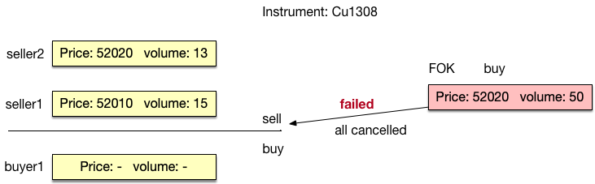
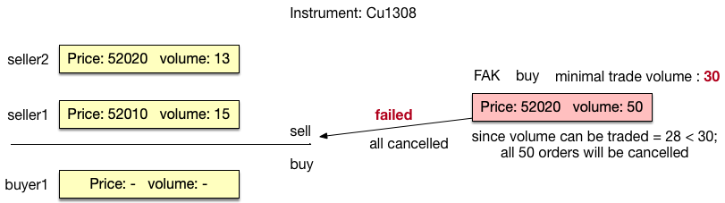
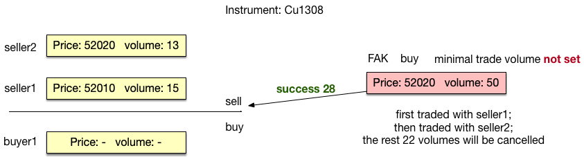

<!-- TOC -->

- [1. FOK & FAK](#1-fok-fak)
- [2. Options](#2-options)
<!-- TOC -->

# 1. FOK & FAK
### definition
+ FOK(fill or kill) indicates that the pending orders are either to be traded or totally cancelled;
+ FAK(fill and kill) indicates that the pending orders are partially traded while the rest will be cancelled by trading system;
    you can set minimal trade volume selectively: 
    - if you set the minimal trade volume( minTradeV ) and the volumes of orders you send which can be traded >= minTradeV, then the rest orders will be cancelled. Otherwise, all the orders you send will be cancelled by trading system.
    - else the orders will be partially traded and be partially cancelled
### notes:
+ FOK & FAK instructions can't be used int the pre-market opening session.
+ FOK & FAK should coordinate the 'limit price instruction' offered by exchange.

### instance
+ fok:

+ fak:
    - set minimal trade volume t0 30:
    
    - minimal trade volume not set:
    

# 2. Options
+ 期权定价模型BS和二叉树区别：
    - BS模型：
    原理：BS模型用于定价欧式期权，由Fisher Black、Myron Scholes和Robert Merton提出。基于假设了无风险利率、股票价格的对数正态分布、无套利机会等。
    特点：BS模型优点在于其简单性和数学上的完整性，能够计算欧式期权的理论价格。
    - 二叉树定价模型：
    原理： 二叉树定价模型是基于离散化时间和价格的方法。最常见的是二叉期权定价模型（Binomial Option Pricing Model），由 Cox-Ross-Rubinstein 提出。它将时间划分为离散的步长，并在每个时间步长上考虑资产价格的上升和下降。
    特点： 二叉树模型相对 BS 模型更灵活，可以处理更多种类的期权和更复杂的情况。
+ 期权希腊字母：
    Delta（Δ）： 衡量期权价格变动相对于标的资产价格变动的敏感性。
    Gamma（Γ）： 衡量 Delta 对标的资产价格变动的敏感性。
    Theta（Θ）： 衡量期权价格随时间流逝而变化的速度。
    Vega（ν）： 衡量期权价格对波动率变动的敏感性。
    Rho（ρ）： 衡量期权价格对无风险利率变动的敏感性。